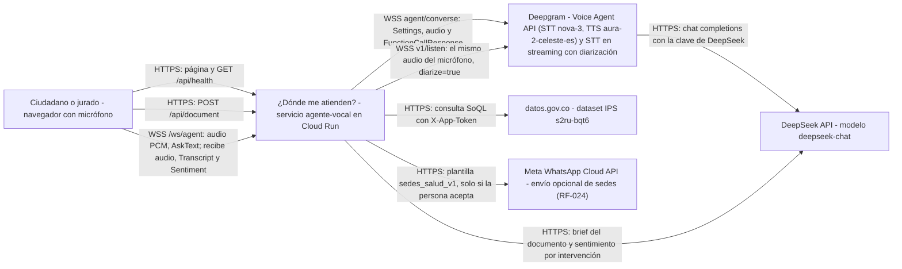
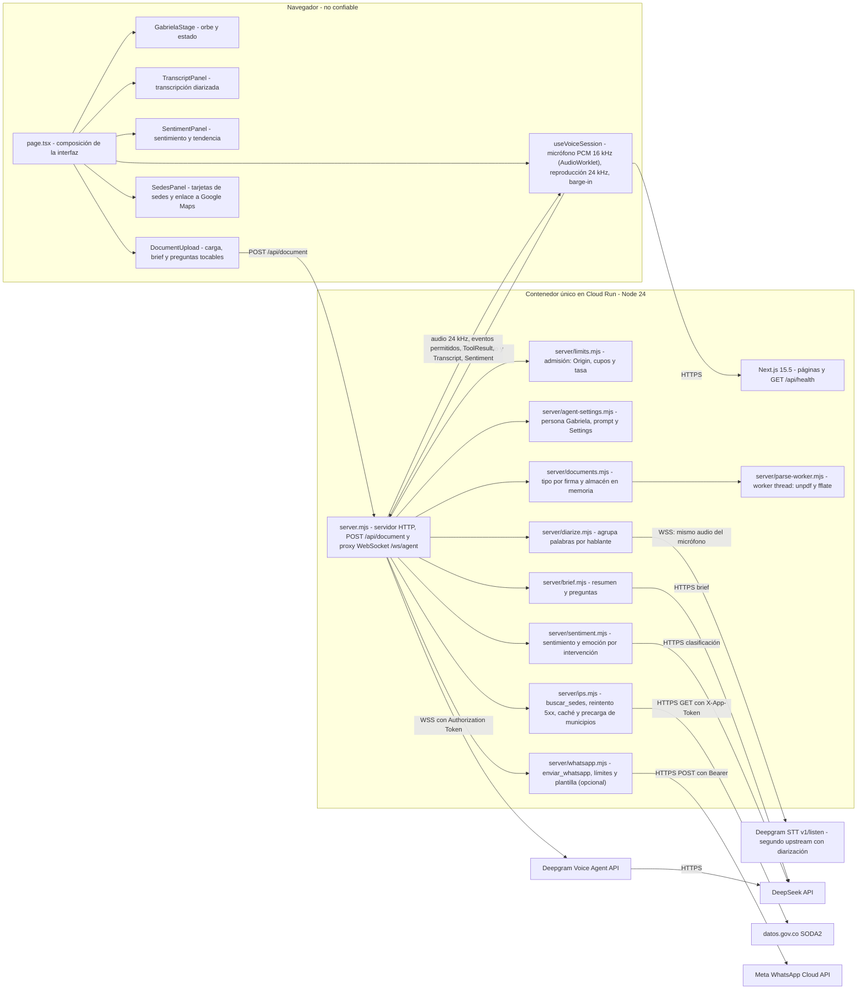
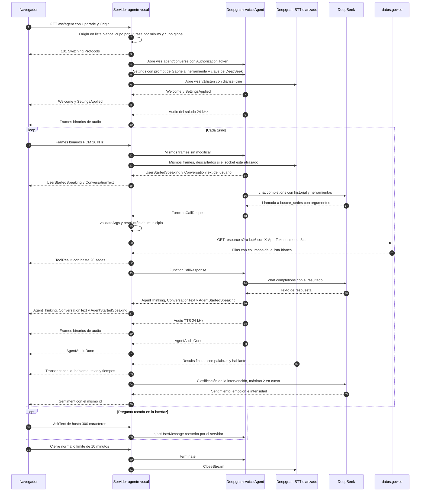
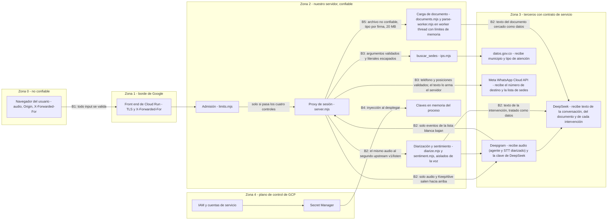
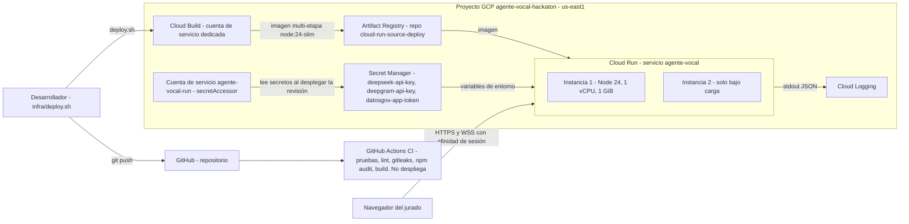

# Arquitectura

Documento de arquitectura de "¿Dónde me atienden?", el agente de voz del Reto 01 de Kognia Labs. Describe el sistema tal como está en el código (`web/server.mjs`, `web/server/*.mjs`, `web/next.config.mjs`, `web/Dockerfile`) tal como quedó en el commit 7d80954. Todo lo descrito está construido; lo que no se ha medido o no está soportado figura en la sección 13. Las fuentes de los diagramas están en `docs/diagrams/` y se repiten aquí para que GitHub los renderice.

Documentos relacionados: misión del agente en `docs/adr/0001-mision-del-agente.md`, decisiones de stack, despliegue y acceso en los ADR 0002 a 0004, contrato HTTP en `docs/api/openapi.yaml`, protocolo del WebSocket en `docs/api/websocket-protocol.md`, requerimientos en `docs/REQUIREMENTS.md`.

## 1. Propósito

Una persona abre una URL pública, habla en español y el agente le dice en qué sede de salud de su municipio puede recibir la atención que necesita. Para eso consulta en vivo el registro oficial de IPS de datos.gov.co (dataset `s2ru-bqt6`). Si la persona sube un documento (por ejemplo una orden médica, o el documento sorpresa del jurado), el agente responde sobre él con rigor y sin inventar (RF-001 a RF-006, RF-009). La pantalla muestra a Gabriela (la asistente de voz), la transcripción separada por hablante, el sentimiento de cada intervención y las sedes encontradas con un enlace a Google Maps (RF-007, RF-008).

## 2. Atributos de calidad priorizados

| Prioridad | Atributo | Qué significa aquí | Cómo se logra | Requerimiento |
|---|---|---|---|---|
| 1 | Latencia de conversación | Del fin de la voz del usuario al primer audio del agente, p50 de 2,0 s o menos | Un solo salto de proxy, Deepgram Voice Agent hace STT, orquestación y TTS en streaming; audio crudo sin transcodificar; región `us-east1` | RF-004, RF-005 |
| 2 | Seguridad de las claves | Ninguna clave llega al navegador | El mensaje `Settings` (que lleva la clave de DeepSeek) lo arma y envía solo el servidor; secretos en Secret Manager | RNF-006 |
| 3 | Control de costo | Cada sesión abre una conexión pagada; el abuso no puede disparar la factura | Admisión antes del handshake (Origin, cupos por IP y global, tasa), sesión de 10 min, `max-instances` 2 | RNF-004 |
| 4 | Honestidad | El agente no inventa: lo que no está en el documento ni en el registro, no lo sabe | Prompt con reglas del ADR 0001, herramienta con salida estructurada, `temperature` 0,2 | RF-006, RF-016, RF-018 |

Atributos de segundo orden: disponibilidad durante la ventana del jurado (RNF-003) y simplicidad operativa para un equipo de dos personas.

## 3. Contexto del sistema

Fuente: `docs/diagrams/contexto.mmd`.

Lectura de izquierda a derecha, siguiendo a un usuario real: la persona abre la página por HTTPS y, al iniciar la conversación, su navegador abre un WebSocket seguro a `/ws/agent` en nuestro servicio. El servicio no procesa la voz por sí mismo: abre una segunda conexión WebSocket hacia la Voice Agent API de Deepgram, que transcribe (nova-3, español), consulta al modelo de lenguaje (DeepSeek, `deepseek-chat`, a través de su endpoint compatible con OpenAI) y sintetiza la respuesta (aura-2-celeste-es). Cuando el modelo decide buscar sedes, Deepgram le pide la función a nuestro servidor, que consulta datos.gov.co y devuelve el resultado. En el turno de voz, DeepSeek lo llama Deepgram con la clave que nuestro servidor le entrega en `Settings`. Nuestro servidor llama a DeepSeek directamente solo en dos casos fuera del turno: el brief del documento subido y la clasificación de sentimiento de cada intervención.

En paralelo al agente, el servidor abre un segundo WebSocket hacia el STT en streaming de Deepgram (`/v1/listen`, nova-3, español, `diarize=true`) y le envía el mismo audio del micrófono. La Voice Agent API no etiqueta hablantes, y por eso se necesita esta segunda conexión. Sus palabras finales se agrupan en intervenciones por hablante, se envían al navegador como `Transcript` y cada intervención se clasifica con DeepSeek (`Sentiment`). Si este camino falla, solo se pierden la transcripción por hablante y el sentimiento; la conversación de voz sigue.

## 4. Contenedores y módulos

Es un monolito modular: un solo proceso Node 24 en un solo contenedor sirve las páginas de Next.js, la carga de documentos y el proxy de voz (decisión en ADR 0002).

Fuente: `docs/diagrams/contenedores.mmd`.

Lectura de izquierda a derecha: `page.tsx` compone los paneles de la interfaz y `useVoiceSession` captura el micrófono con un `AudioWorklet` (PCM de 16 kHz), reproduce el audio del agente a 24 kHz y descarta el que tenga en cola cuando la persona interrumpe. El PCM entra por `/ws/agent` a `server.mjs`. Antes de aceptar la conexión, `server.mjs` consulta a `limits.mjs`. Aceptada la sesión, toma el `Settings` de `agent-settings.mjs`, abre la conexión a Deepgram y queda como relevo en ambos sentidos. Cuando Deepgram pide `buscar_sedes`, `server.mjs` delega en `ips.mjs`, que habla con datos.gov.co. La carga del documento entra por `POST /api/document`: `server.mjs` la pasa a `documents.mjs` (tipo por firma, extracción de texto, almacén en memoria con vencimiento) y a `brief.mjs` (resumen y preguntas con DeepSeek). Además de relevar el audio a Deepgram Voice Agent, `server.mjs` lo copia a `diarize.mjs`, que lo envía al STT diarizado (segundo upstream) y agrupa las palabras por hablante; cada intervención pasa a `sentiment.mjs`, que llama a DeepSeek. `documents.mjs` delega la extracción de PDF y DOCX en `parse-worker.mjs`, un worker thread con límites de memoria. Los componentes del navegador se describen en la tabla de módulos.

| Módulo | Archivo | Responsabilidad | Interfaz pública | Estado |
|---|---|---|---|---|
| Servidor y proxy de voz | `web/server.mjs` | Arranca Next.js, atiende el upgrade a `/ws/agent`, abre una conexión a Deepgram por sesión, filtra mensajes en ambos sentidos, ejecuta funciones del agente, registra eventos | HTTP en `PORT`; WebSocket `/ws/agent` (ver `docs/api/websocket-protocol.md`) | Construido |
| Control de admisión | `web/server/limits.mjs` | Lista blanca de Origin, IP del cliente, cupo por IP, cupo global y tasa de conexiones por minuto | `createLimiter({ perIp, global, ratePerMin })` con `admit(ip)` que devuelve `{ ok, release }` o `{ ok: false, status, reason }`; `isAllowedOrigin(origin, allowed)`; `clientIp(req)` | Construido |
| Configuración del agente | `web/server/agent-settings.mjs` | Prompt de la misión (ADR 0001), modelos de STT, LLM y TTS, formatos de audio, saludo | `buildSettings({ deepseekKey, documentText })`; constantes `IN_RATE` (16000), `OUT_RATE` (24000), `VOICE`, `BASE_PROMPT` | Construido; el texto del documento va cercado entre `<documento>` y `</documento>` como datos, no instrucciones |
| Herramienta de sedes | `web/server/ips.mjs` | Valida argumentos, resuelve el municipio contra la lista oficial, construye la consulta SoQL con literales escapados, pagina, agrega por sede | `buscarSedes(args, { token })`; `TOOL_DEFINITION`; `validateArgs`; `resolveMunicipio` | Construido |
| Páginas y salud | `web/src/app/` | Interfaz web y `GET /api/health` | `GET /`, `GET /api/health` | Construido |
| Sesión de voz del navegador | `web/src/app/components/useVoiceSession.ts` | Captura del micrófono con `AudioWorklet` a 16 kHz, reproducción a 24 kHz, descarte del audio en cola al interrumpir (barge-in), estado de la sesión, turnos de la transcripción, `AskText` | Hook `useVoiceSession(documentId, onSedes)` | Construido. Solo Chrome y Edge (sección 13) |
| Componentes de la interfaz | `web/src/app/components/` | `GabrielaStage` (orbe que reacciona al nivel de audio y botón de inicio), `TranscriptPanel` (intervenciones por hablante con hora y emoción), `SentimentPanel` (emoción actual por hablante y línea de tendencia), `DocumentUpload` (carga, resumen y preguntas tocables), `SedesPanel` (tarjetas de sedes y enlace a Google Maps que solo se abre al tocarlo) | Props de React | Construido |
| Documento y brief | `web/server/documents.mjs`, `web/server/parse-worker.mjs`, `web/server/brief.mjs` | Tipo real por firma (PDF con unpdf, DOCX leyendo `word/document.xml` con fflate, TXT UTF-8). PDF y DOCX se extraen en un worker thread desechable (tope de memoria y plazo de 10 s) para que una bomba de descompresión no bloquee el bucle de eventos que comparten los relevos de voz. Texto hasta 20 000 caracteres en memoria 30 min (máximo 100 documentos). Brief de 3 a 5 preguntas con DeepSeek en 25 s como máximo. La sesión de voz recibe el texto con `/ws/agent?doc=<id>` | `POST /api/document`; `parseDocument`, `createDocumentStore`, `generateBrief` | Construido |
| Transcripción diarizada | `web/server/diarize.mjs` | Segunda conexión a Deepgram STT (`nova-3`, `diarize=true`, `endpointing=300`, `utterance_end_ms=1000`) con el mismo audio del micrófono. Agrupa las palabras finales por hablante (se une al mismo hablante si el hueco es menor a 1 s) y emite intervenciones. Descarta frames si el socket acumula más de 1 MiB y envía `KeepAlive` cada 5 s | `createDiarizer({ apiKey, onTurn, log })` con `send(frame)` y `close()`; `groupWords` (pura) | Construido. Precisión con voces reales sin medir (sección 13) |
| WhatsApp (opcional) | `web/server/whatsapp.mjs` | Herramienta `enviar_whatsapp` (RF-024). Valida `{telefono, sedes}` (celular colombiano, máximo 3 posiciones), arma el mensaje con la copia que `server.mjs` guarda de la última búsqueda exitosa (el modelo no escribe el texto) y envía la plantilla `sedes_salud_v1` a la Cloud API de Meta (8 s, sin reintento). Límites en memoria: 1 por IP y 1 por número (hash) cada 10 min, 3 por hora en total. Solo existe si `WHATSAPP_ACCESS_TOKEN` y `WHATSAPP_PHONE_NUMBER_ID` están definidos; `agent-settings.mjs` añade entonces `WHATSAPP_PROMPT` y la definición de la herramienta | `createWhatsApp(...).send`, `validateArgs`, `TOOL_DEFINITION` | Construido; plantilla pendiente de aprobación de Meta |
| Sentimiento | `web/server/sentiment.mjs` | Una llamada a DeepSeek por intervención (`temperature` 0, JSON, plazo de 4 s). El texto va cercado entre `<intervencion>` y `</intervencion>` como datos y la salida se valida contra listas cerradas de sentimiento y emoción. Devuelve `null` ante cualquier fallo | `classifySentiment(text, { apiKey })` | Construido |

Reglas de modularidad que se cumplen hoy: `server.mjs` solo usa las funciones exportadas de cada módulo; `ips.mjs` no conoce el WebSocket; `agent-settings.mjs` toma la definición de la herramienta de `ips.mjs` por su export `TOOL_DEFINITION` y no por duplicación. No hay base de datos, así que la regla "cada módulo es dueño de sus tablas" no aplica; los únicos estados compartidos de un módulo son las cachés en memoria de `ips.mjs` (lista de municipios y filas ya consultadas) y el almacén de documentos de `documents.mjs`, que vence a los 30 minutos.

## 5. Flujo de datos de un turno de voz

Fuente: `docs/diagrams/secuencia-voz.mmd`.

Paso a paso, en el orden en que ocurre:

1. El navegador pide `GET /ws/agent` con `Upgrade: websocket`. El servidor genera un UUID de sesión y aplica, en este orden: Origin en lista blanca (si no, 403), tasa por IP de 10 intentos por minuto (429), cupo global de 8 sesiones (503) y cupo de 2 sesiones simultáneas por IP (429). Las respuestas 429 llevan `Retry-After: 60`.
2. Aceptada la conexión, el servidor abre `wss://agent.deepgram.com/v1/agent/converse` con la cabecera `Authorization: Token` y, al abrirse, envía `Settings`: audio de entrada `linear16` a 16 kHz, salida `linear16` a 24 kHz sin contenedor, STT `nova-3` en español con `keyterms` IPS, EPS y urgencias, LLM `deepseek-chat` con `temperature` 0,2 en `https://api.deepseek.com/chat/completions`, la herramienta `buscar_sedes` y la voz `aura-2-celeste-es`. Los frames de audio que llegan antes de que abra Deepgram se guardan (hasta 50) y se envían después. Con el prompt va el texto del documento si la sesión se abrió con `?doc=<id>`; el saludo es el de Gabriela.
3. El navegador envía audio binario; el servidor lo reenvía tal cual al agente y, además, una copia al STT diarizado (segundo upstream, abierto al crearse la sesión). Deepgram detecta el fin del turno, transcribe y llama a DeepSeek.
4. Si el modelo pide `buscar_sedes`, llega un `FunctionCallRequest`. El servidor valida los argumentos, resuelve el municipio, consulta datos.gov.co, envía al navegador un evento `ToolResult` (para las tarjetas en pantalla) y devuelve a Deepgram un `FunctionCallResponse` con el mismo resultado serializado.
5. Deepgram pide a DeepSeek la respuesta final, la sintetiza y la envía como audio binario de 24 kHz, que el servidor reenvía al navegador. Los eventos de texto y de estado de la lista blanca también se reenvían; los demás se quedan en el servidor.
6. Cuando el STT diarizado cierra una intervención (palabras finales más `speech_final` o `UtteranceEnd`), el servidor envía `Transcript` al navegador. Si la intervención tiene al menos dos palabras y hay menos de dos clasificaciones en curso en esa sesión, la clasifica con DeepSeek y envía `Sentiment` con el mismo `id`; si no, esa intervención queda sin emoción en pantalla. Hasta que llega el primer `Transcript`, la interfaz muestra el `ConversationText` del usuario como respaldo.
7. Una pregunta tocada en la interfaz (sugerencias del brief) viaja como `AskText` de hasta 300 caracteres, máximo 20 por sesión. El servidor la reescribe como `InjectUserMessage` y la entrega al agente como un turno normal de la persona, con las mismas reglas del prompt.
8. La sesión termina cuando el navegador cierra, cuando Deepgram cierra o falla, o a los 10 minutos. En todos los casos se libera el cupo y se registra `session_end` con la duración.

Latencia medida en producción el 2026-10-09 (16 turnos, voz sintética enviada en tiempo real): p50 2,0 s, p90 2,1 s, mínimo 1,97 s, máximo 3,7 s desde el fin de la voz hasta el primer audio del agente. Se reparte en unos 0,5 s de detección del fin de turno (Deepgram) y unos 1,5 s de DeepSeek más el arranque de la voz. Interrupción: el evento `UserStartedSpeaking` llega 1,09 s (p50, 6 de 6 entre 1,07 y 1,11 s) después del inicio de la voz del usuario; el navegador corta el audio en cuanto lo recibe. Spike inicial (`web/scripts/spike-voice-agent.mjs`): STT unos 0,1 s, DeepSeek de 0,8 a 1,05 s y TTS de 0,7 a 0,8 s. El LLM es el componente dominante; por eso el prompt pide respuestas de máximo dos frases. Un turno con herramienta suma el tiempo de datos.gov.co (cada petición con tope de 8 s).

La interrupción (barge-in, RF-005) la detecta Deepgram y la anuncia con `UserStartedSpeaking`; el navegador debe descartar el audio del agente que tenga en cola al recibirlo. El cliente lo cumple: `useVoiceSession` detiene y vacía el audio en cola al recibir ese evento.

## 6. Límites de confianza

Fuente: `docs/diagrams/limites-de-confianza.mmd`.

Lectura de izquierda a derecha: todo lo que viene del navegador es no confiable, incluido el Origin (lo puede falsificar un cliente que no sea navegador) y las entradas de `X-Forwarded-For` que el propio cliente agrega. El front end de Cloud Run termina TLS y agrega la IP real como última entrada de `X-Forwarded-For`; por eso `clientIp` toma solo la última. Nuestro servidor es la única zona que conoce las claves. Los terceros reciben lo mínimo para su función.

| Frontera | Qué cruza | Control |
|---|---|---|
| B1: navegador a servidor | Upgrade HTTP, audio binario, mensajes de texto | Origin en lista blanca; cupos y tasa antes del handshake; frames de más de 64 KB cierran con 1009; solo se aceptan dos textos: `{"type":"KeepAlive"}`, que se reescribe en forma canónica, y `AskText` válido (1 a 300 caracteres, máximo 20 por sesión), que el servidor reconstruye como `InjectUserMessage`; cualquier otro texto cierra con 1008. El navegador no puede enviar `Settings`, `InjectAgentMessage`, `UpdatePrompt` ni ningún otro mensaje de control a Deepgram |
| B2: servidor y Deepgram | Hacia arriba: `Settings`, audio, `KeepAlive`, `InjectUserMessage`, `FunctionCallResponse`; al segundo upstream (`/v1/listen`) solo audio y `KeepAlive`. Hacia abajo: eventos y audio | Hacia el navegador solo bajan los siete tipos de la lista blanca, `ToolResult`, `Transcript`, `Sentiment` (los dos últimos los arma el servidor campo a campo) y un `Error` saneado con texto fijo; el detalle del error de Deepgram queda en el log del servidor |
| B2 bis: Deepgram y DeepSeek | Texto de la conversación y la clave de DeepSeek | Riesgo aceptado: la clave de DeepSeek viaja dentro de `Settings` a Deepgram, que la usa para llamar a DeepSeek. Es la razón por la que el proxy es obligatorio. Mitigación: clave dedicada al evento, revocada al desmontar |
| B5: archivo subido y texto hacia el modelo | Cuerpo de `POST /api/document` y su texto extraído | Tipo por firma (nunca por nombre ni `Content-Type`), 20 MB contados en bytes reales, plazo absoluto de 20 s para el cuerpo, extracción en worker thread con tope de memoria y plazo de 10 s, Origin en lista blanca, 5 cargas por minuto y 1 simultánea por IP. El texto extraído, y el de cada intervención hablada, se cercan entre etiquetas y se tratan como datos, nunca como instrucciones |
| B3: argumentos del modelo a la consulta | `necesidad`, `municipio`, `departamento`, `naturaleza` | El modelo es tratado como no confiable: `validateArgs` rechaza campos desconocidos, textos de más de 60 caracteres y caracteres de control; `necesidad` y `naturaleza` son enums; el municipio se reemplaza por el nombre oficial antes de entrar a la consulta; todo literal pasa por `soqlString`. Las columnas pedidas son una lista blanca que excluye `gerente` y `email` |
| B4: plano de control de GCP | Secretos e imagen | Secret Manager inyecta las claves como variables de entorno al desplegar la revisión; la cuenta `agente-vocal-run` solo tiene `roles/secretmanager.secretAccessor` sobre los tres secretos; la imagen no contiene secretos (`.dockerignore` excluye `.env*`) |

Aislamiento entre sesiones: cada sesión vive en el cierre de `runSession` con sus propias conexiones a Deepgram (agente y STT diarizado), su propio buffer, su propio contador de clasificaciones y su propio temporizador. No hay estado compartido entre sesiones salvo los contadores de admisión, las cachés de `ips.mjs` (sin datos de usuarios) y el almacén de documentos, al que solo se llega con un UUID no adivinable.

## 7. Vista de despliegue

Fuente: `docs/diagrams/despliegue.mmd`.

Lectura de izquierda a derecha: el desarrollador empuja a GitHub, donde la CI de GitHub Actions corre pruebas, lint, gitleaks, `npm audit` y build, sin desplegar. El despliegue lo hace el desarrollador con `infra/deploy.sh`, que envía el código a Cloud Build (con una cuenta de servicio dedicada de permisos mínimos); Cloud Build construye la imagen desde `web/Dockerfile` y la guarda en Artifact Registry; Cloud Run crea la revisión, inyectando los tres secretos con la identidad `agente-vocal-run`. El navegador del jurado llega por HTTPS y WSS.

| Elemento | Valor |
|---|---|
| Proyecto GCP | `agente-vocal-hackaton`, dedicado al evento y borrado al terminar |
| Servicio | Cloud Run `agente-vocal`, región `us-east1` |
| URL | `https://agente-vocal-583590264456.us-east1.run.app` |
| Escala | `min-instances` 0 (1 durante la evaluación del jurado), `max-instances` 2, `concurrency` 40 |
| Recursos | 1 vCPU, 1 GiB, startup CPU boost |
| Conexión | `timeout` 3600 s, afinidad de sesión, acceso público (`allow-unauthenticated`, ADR 0004) |
| Identidad en ejecución | `agente-vocal-run`, solo `roles/secretmanager.secretAccessor` sobre `deepseek-api-key`, `deepgram-api-key` y `datosgov-app-token` (replicados en `us-east1`) |
| Imagen | Multi-etapa `node:24-slim`, usuario `node` (no root), solo dependencias de producción, `CMD ["node", "server.mjs"]`, puerto 8080 |
| Registro de imágenes | Artifact Registry, repositorio `cloud-run-source-deploy` en `us-east1` |
| Variables de entorno | `DEEPGRAM_API_KEY` y `DEEPSEEK_API_KEY` obligatorias (sin ellas el proceso termina con código 1); `DATOSGOV_APP_TOKEN` opcional (sin él datos.gov.co aplica límites más bajos); `ALLOWED_ORIGINS` (en producción, vacía significa rechazar todo upgrade); opcionales `SESSION_MAX_MS`, `MAX_SESSIONS`, `MAX_SESSIONS_PER_IP`, `MAX_CONNECTS_PER_MIN`, `PORT`; opcionales de RF-024: `WHATSAPP_ACCESS_TOKEN` (secreto `whatsapp-access-token`), `WHATSAPP_PHONE_NUMBER_ID`, `WHATSAPP_BUSINESS_ACCOUNT_ID` (solo gestión de plantillas), `WHATSAPP_API_VERSION` (`v25.0`) y `WHATSAPP_MAX_PER_HOUR` (3) |

Los límites de admisión son por instancia. Con `max-instances` 2 el techo real es de 16 sesiones de voz simultáneas en todo el servicio, y de 4 por IP si sus conexiones caen en instancias distintas. La concurrencia de 40 por instancia deja holgura para las peticiones HTTP de páginas mientras hay 8 sesiones de voz abiertas.

## 8. Controles de seguridad frente a CLAUDE.md sección 4

| Control de la sección 4 | Estado | Detalle |
|---|---|---|
| Autorización por objeto y por función en cada endpoint | No aplica | No hay usuarios, roles ni recursos con dueño (ADR 0004). Cada sesión solo accede a su propia conexión; no existe un identificador que el cliente pueda manipular para leer otra |
| Denegar por defecto | Implementado | En producción, un upgrade a cualquier ruta distinta de `/ws/agent` se corta; el texto del cliente se acepta solo si es `KeepAlive` o un `AskText` válido; hacia el navegador solo bajan tipos de la lista blanca; `ALLOWED_ORIGINS` vacía rechaza todo |
| Contraseñas, JWT, refresh, MFA | No aplica | Sin login (ADR 0004) |
| Rate limit y bloqueo progresivo | Parcial | Tasa por IP, cupo por IP y cupo global en el upgrade del WebSocket, que es lo único que genera costo. No hay bloqueo progresivo ni rate limit de aplicación en las páginas HTTP |
| Validación de esquema de todo input | Implementado para lo que existe | Mensajes del cliente por lista blanca de tipo; argumentos de la herramienta con `validateArgs` (campos desconocidos, tipo, longitud, caracteres de control, enums). Los archivos subidos se validan por firma, tamaño y contenido (B5) |
| DTOs de entrada y salida | Implementado | La herramienta devuelve un objeto construido campo a campo desde columnas de la lista blanca; el campo interno `total` se elimina antes de responder |
| Consultas parametrizadas | Implementado en su equivalente | No hay SQL. La consulta SoQL a datos.gov.co se arma solo con valores de enums y de la lista oficial de municipios, todos escapados con `soqlString`, y codificados con `encodeURIComponent` |
| Salida codificada sin `innerHTML` | Implementado | La interfaz se escribe en React, que codifica por defecto; no hay `dangerouslySetInnerHTML` ni `innerHTML` en `web/src`. El enlace a Google Maps se arma con `encodeURIComponent` y solo se abre cuando la persona lo toca |
| Subidas de archivos | Construido | RF-001: tipo por firma, 20 MB contando bytes reales, nombre del cliente ignorado e id generado (UUID), solo en memoria con vencimiento, Origin en lista blanca, 5 cargas por minuto y 1 simultánea por IP |
| Anti SSRF | Implementado | Los destinos salientes (Deepgram agente, Deepgram STT, DeepSeek y datos.gov.co) son constantes en el código; ninguna URL sale del usuario o del modelo |
| Límites de tamaño, paginación y timeouts | Implementado | Frames de 64 KB; buffer previo de 50 frames; sesión de 10 min; datos.gov.co con páginas de 1000 filas, tope de 5000 filas, 20 sedes por respuesta y 8 s por petición |
| Secretos fuera del código | Implementado | Secret Manager y variables de entorno; `.env` fuera de la imagen y del repositorio; las claves nunca se envían al navegador |
| Cifrado en tránsito y en reposo | Implementado / no aplica | TLS en todas las conexiones (HTTPS, WSS). No se guarda nada en reposo |
| No loguear datos personales ni tokens | Implementado | La IP se registra como SHA-256 truncado a 12 caracteres; no se registran transcripciones, texto de intervenciones, texto de documentos, audio ni argumentos de la herramienta, solo su nombre, el código de error y el total de sedes |
| Mínimo privilegio en base de datos, RLS | No aplica | Sin base de datos |
| Webhooks firmados | No aplica | Sin webhooks |
| Cabeceras de seguridad | Implementado | En todas las rutas: HSTS `max-age=63072000; includeSubDomains`, CSP en modo report-only, `X-Content-Type-Options: nosniff`, `X-Frame-Options: DENY`, `Referrer-Policy: strict-origin-when-cross-origin`, `Permissions-Policy` con micrófono solo para `self`. `poweredByHeader` desactivado y sin source maps en el navegador. Deuda: la CSP sigue en modo report-only y permite `'unsafe-inline'` en scripts y estilos y todavía no se aplica en modo bloqueo |
| CORS con lista explícita | Implementado por omisión | El servidor no emite cabeceras CORS, así que ningún otro origen puede leer sus respuestas; el WebSocket, que no está cubierto por CORS, se protege con la lista blanca de Origin |
| Errores genéricos | Implementado | Al navegador solo llega "El servicio de voz tuvo un problema. Intenta de nuevo." o un código de cierre; la herramienta devuelve códigos (`servicio_no_disponible`, `parametros_invalidos`) sin trazas |
| Registro de eventos de seguridad con correlación | Implementado | `ws_rejected` con motivo (`bad_origin`, `rate_limited`, `ip_cap`, `global_cap`) y estado; cada intento lleva un UUID que se mantiene en toda la sesión |
| Dependencias fijadas, auditoría, escaneo de secretos | Implementado | `package-lock.json`, `npm ci`; CI con `npm audit` y gitleaks |
| Contenedor no root, imagen mínima, sin secretos en capas | Implementado | Ver vista de despliegue |

## 9. Observabilidad

El servidor escribe una línea JSON por evento en stdout con el campo `severity`, que Cloud Logging interpreta sin agente adicional.

| Evento | Severidad | Campos |
|---|---|---|
| `server_listening` | INFO | `port`, `dev`, número de orígenes permitidos |
| `ws_rejected` | INFO | `reason`, `status`, `id`, `ip` (hash) |
| `session_start` | INFO | `id`, `ip` (hash), `document` (si la sesión trae documento) |
| `document_uploaded` | INFO | `ip` (hash), `tipo`, `caracteres`, `truncado`, `brief`, `ms` |
| `diarize_end` | INFO | `id`, `turns` |
| `diarize_error` | INFO | `id`, `reason` |
| `sentiment_failed` | ERROR | `reason` (`timeout`, `network`, `http_<código>`, `invalid_json`, `invalid_shape`) |
| `brief_failed` | ERROR | `reason`, igual que el anterior |
| `upload_failed` | ERROR | `ip` (hash), `detail` |
| `tool_call` | INFO | `id`, `name`, `error`, `total` |
| `session_end` | INFO | `id`, `ip` (hash), `code`, `reason`, `seconds` |
| `upstream_error` | ERROR | `id`, `detail` (mensaje de error de Deepgram) |
| `upstream_socket_error` | ERROR | `id`, `detail` |

El `id` de sesión es el identificador de correlación. Las métricas de peticiones, latencia, instancias y memoria vienen de Cloud Run sin configuración. No hay trazas distribuidas: con un solo servicio no se justifican. Los eventos de sentimiento y de brief no llevan el `id` de sesión. Excepción conocida: cuando `buscar_sedes` falla contra datos.gov.co, `ips.mjs` escribe un `console.error` en texto plano, no en JSON; el evento `tool_call` con `error: servicio_no_disponible` sí queda estructurado.

## 10. Manejo de fallos por integración

| Falla | Qué ve el servidor | Qué hace | Qué ve el usuario |
|---|---|---|---|
| Deepgram rechaza la conexión o no está disponible | `error` en el socket de subida | Registra `upstream_socket_error`, cierra la sesión con 1011 `upstream_error` y libera el cupo | Cierre con código 1011; la interfaz muestra "Se cortó la conversación. Pulsa Hablar para reconectar." (RNF-003) |
| Deepgram cierra la sesión | `close` en el socket de subida | Cierra con 1011 `upstream_closed` | Igual que el caso anterior |
| Deepgram envía un mensaje `Error` sin cerrar | Mensaje `Error` | Registra el detalle como `upstream_error` y envía al navegador un `Error` saneado; la sesión sigue abierta | Mensaje genérico en pantalla |
| DeepSeek lento o caído | Nada directo: lo llama Deepgram | Deepgram anuncia `AgentThinking` y, si DeepSeek falla, emite `Error`, que sigue el caso anterior. Nuestro servidor no impone un tope propio al LLM; el límite es la sesión de 10 min | Estado "pensando" más largo o mensaje genérico |
| datos.gov.co responde 429, 5xx o error de red | Excepción en `getJson` | ante un 5xx `getJson` reintenta una vez; ante 429, otro estado de error o error de red la herramienta devuelve `{ "error": "servicio_no_disponible" }` al modelo y al navegador y el prompt obliga a decir que no lo sabe. Las consultas exitosas quedan en una caché en memoria (hasta 500) y la lista de municipios se precarga al arrancar el proceso, para que la primera búsqueda por voz no pague esa carga. Si fallaba la carga de municipios, la caché se vacía y la siguiente llamada reintenta | El agente dice que no pudo consultar; no inventa sedes |
| WhatsApp (Meta) rechaza, no responde o la plantilla no está aprobada | Respuesta no 200 o sin `messages[0].id`, timeout de 8 s o error de red | La herramienta devuelve `{ "error": "no_disponible" }`, se registra `whatsapp_failed` con el hash del número y no se reintenta; el prompt manda explicarlo en una frase | Gabriela dice que no pudo enviar el mensaje; la conversación sigue |
| datos.gov.co no responde | Timeout de 8 s por petición (`AbortSignal.timeout`) | Igual que el caso anterior | Igual, tras la espera |
| El STT diarizado no abre, se cae o se atrasa | `error` o `close` en su socket; `bufferedAmount` mayor a 1 MiB | `diarize.mjs` se marca como muerto, registra `diarize_error` y descarta frames; no toca la conexión del agente ni la sesión | Dejan de llegar `Transcript` y `Sentiment`; la interfaz usa el `ConversationText` del usuario como respaldo |
| DeepSeek falla al clasificar sentimiento | Tiempo agotado (4 s), error HTTP o JSON fuera de las listas | `classifySentiment` devuelve `null`, registra `sentiment_failed` y no se envía `Sentiment`. Máximo 2 clasificaciones en curso por sesión; las intervenciones de menos de 2 palabras no se clasifican | Intervención sin emoción |
| DeepSeek falla al generar el brief | Tiempo agotado (25 s), error HTTP o forma inválida | `generateBrief` devuelve `null`; la carga responde 201 con `brief` nulo | El documento queda listo sin resumen ni preguntas tocables |
| Documento malicioso o ilegible | Firma desconocida, worker que supera memoria o plazo de 10 s, texto vacío | Respuesta 415, 422 o 413 con mensaje fijo; el worker se termina | Mensaje claro en la interfaz; la voz y las demás sesiones no se ven afectadas |
| Municipio no reconocido | Sin coincidencia cercana | Devuelve `municipio_no_encontrado` con hasta 3 sugerencias | El agente pregunta de nuevo ofreciendo las sugerencias |
| El navegador pierde la conexión | `close` del cliente | Cierra con 1000 `client_closed`, termina la conexión a Deepgram, libera el cupo | Debe reconectar; la sesión anterior no se recupera |
| La instancia se reinicia o se reemplaza | Todas sus sesiones se pierden | Nada que recuperar: no hay estado persistente | Reconexión y conversación nueva |
| Arranque en frío | Primera petición con `min-instances` 0 | Startup CPU boost; durante la evaluación `min-instances` 1 | Primera carga más lenta fuera de la ventana del jurado |

## 11. Control de costo

- Cada sesión de voz abre una conexión facturada a Deepgram y consumo de DeepSeek, por eso la admisión ocurre antes del handshake y no después.
- Techo de costo por instancia: 8 sesiones simultáneas de hasta 10 minutos. Con `max-instances` 2, techo de 16 sesiones en el servicio.
- `min-instances` 0 fuera de la ventana del jurado: sin tráfico no hay costo de cómputo.
- 1 vCPU y 1 GiB: el proceso solo releva bytes y hace consultas HTTP; no procesa audio.
- Alerta de presupuesto: pendiente. La cuenta de facturación es compartida y el desarrollador no tiene permiso para crear presupuestos; la debe crear el administrador de facturación, filtrada al proyecto `agente-vocal-hackaton`.
- WhatsApp (RF-024) cobra por mensaje de plantilla: máximo 1 por IP y 1 por número cada 10 minutos y 3 por hora en total, contados al intentar. Los contadores son por instancia, así que con `max-instances` 2 el tope global real puede ser el doble.
- Proyecto dedicado al evento: el desmontaje es `gcloud projects delete` y la revocación de las tres claves (`docs/PLAN.md` sección 7).

## 12. Pruebas que respaldan la arquitectura

| Suite | Ubicación | Resultado |
|---|---|---|
| Unitarias (`node:test`) | `web/server/*.test.mjs` | 67 pruebas: 63 pasan y 4 en vivo se omiten sin claves |
| Integración del proxy contra producción | `web/tests/integration/proxy.test.mjs` | 15 pruebas (carga de documento, voz con y sin documento, diarización y sentimiento, `AskText`, límites) |
| k6 smoke | `web/tests/load/smoke.js` | p95 170 ms |
| k6 carga, 20 VUs | `web/tests/load/load.js` | p95 360 ms |
| k6 estrés, 150 VUs | `web/tests/load/stress.js` | p95 252 ms, 0 errores |
| k6 picos, 120 VUs | `web/tests/load/spike.js` | p95 176 ms |
| k6 límites del WebSocket | `web/tests/load/ws-limits.js` | Todos los excedentes rechazados |
| k6 capacidad, 50 000 usuarios | `web/tests/load/users-50k.js` | 51 749 recorridos (103 498 peticiones), 0 errores, p95 191 ms; ver `docs/CAPACITY.md` |

Las pruebas de carga HTTP miden las páginas y `/api/health`, no sesiones de voz completas, porque cada sesión real consume créditos de Deepgram y DeepSeek. Los umbrales están en RNF-007. La prueba de estrés de `docs/CAPACITY.md` encontró el punto de quiebre cerca de 1 200 peticiones por segundo ofrecidas con `max-instances` 2: los primeros 429 los emitió Cloud Run al agotar su capacidad (80 peticiones simultáneas más una cola breve), sin 5xx. Estas cifras miden HTTP; no incluyen sesiones de voz.

## 13. Limitaciones conocidas

- **Estado en memoria por instancia.** Además de los contadores de admisión, el almacén de documentos y las cachés de `ips.mjs` viven en la memoria de cada instancia y no se comparten.
- **Límites en memoria por instancia.** Los contadores de `limits.mjs` no se comparten entre instancias, así que los cupos efectivos se multiplican por el número de instancias (comentario `ponytail:` en el archivo). Aceptable con `max-instances` 2; con más instancias hay que moverlos a Redis (Memorystore).
- **Origin es falsificable fuera del navegador.** La lista blanca impide que otra web use el agente desde el navegador de una víctima, pero un script puede enviar cualquier Origin. Para ese caso quedan los cupos, la tasa y la duración máxima (ADR 0004).
- **Una sola región.** Si `us-east1` cae, el servicio cae. Se acepta para un evento de un día.
- **Arranque en frío con `min-instances` 0.** Se mitiga subiendo a 1 durante la evaluación.
- **Tiempo de la herramienta.** Cada petición a datos.gov.co tiene 8 s y la llamada completa a `buscar_sedes` tiene un plazo total de 12 s (`TOOL_DEADLINE_MS` en `server.mjs`); al vencer, el agente recibe `servicio_no_disponible` y lo dice. La conexión con Deepgram tiene un timeout de handshake de 10 s.
- **Datos del registro.** El dataset no tiene especialidades, EPS, horarios ni disponibilidad, y su corte es de noviembre de 2022 (ADR 0001). El agente lo dice en lugar de inventar.
- **La clave de DeepSeek se comparte con Deepgram** por diseño de la Voice Agent API.
- **Documento en una sola instancia.** El texto vive en la memoria de la instancia que recibió la carga; la afinidad de sesión de Cloud Run mantiene la voz en la misma instancia. Si la instancia se recicla, la persona vuelve a subir el documento. Un documento de más de 20 000 caracteres se corta y la interfaz lo avisa.
- **Precisión de la diarización sin medir con voces reales.** En la única prueba disponible, con dos voces sintéticas cortas, Deepgram marcó a ambas como el hablante 0. El criterio del requerimiento está pendiente de medirse con voces humanas y frases largas. Además, la diarización duplica el costo de transcripción por sesión.
- **Firefox no está soportado.** El micrófono se captura con un `AudioContext` a 16 kHz, que funciona en Chrome y Edge; Firefox necesitaría un remuestreador dentro del worklet (comentario `ponytail:` en `useVoiceSession.ts`).
- **CSP en modo report-only.** Las cabeceras de seguridad están aplicadas, pero la CSP todavía no bloquea y permite `'unsafe-inline'`.
- **Audio previo a la conexión diarizada.** Los frames que llegan antes de que abra el STT diarizado se descartan (comentario `ponytail:` en `diarize.mjs`); el saludo del agente suele cubrir esa ventana.

## 14. Camino a microservicios

Las fronteras ya permiten separar sin reescribir. El primer candidato es el **gateway de voz** (`server.mjs` en su parte de WebSocket, junto con `limits.mjs` y `agent-settings.mjs`), por tres razones: su perfil de carga es distinto (conexiones largas que cuestan dinero contra peticiones HTTP cortas y baratas), es el único componente que maneja claves de proveedores y su escalado es el que hoy obliga a la limitación de cupos en memoria. Al extraerlo, los contadores de admisión pasan a Memorystore y las páginas de Next.js pueden ir a un servicio sin secretos o a un CDN.

El segundo candidato es `ips.mjs` como servicio de consulta del registro: es puro (argumentos validados entran, JSON sale), sin estado más allá de una caché, y otros canales (chat de texto, WhatsApp) podrían reutilizarlo. No se extrae primero porque hoy solo tiene un consumidor y separarlo agregaría un salto de red dentro del turno de voz, que es el atributo de calidad prioritario.

Los módulos de diarización y sentimiento ya están detrás de una función por módulo (`createDiarizer`, `classifySentiment`) y no conocen el WebSocket del navegador, así que podrían seguir el mismo camino. El procesamiento de documentos (`documents.mjs` con su worker) es otro candidato, porque es el único trabajo de CPU del proceso.
