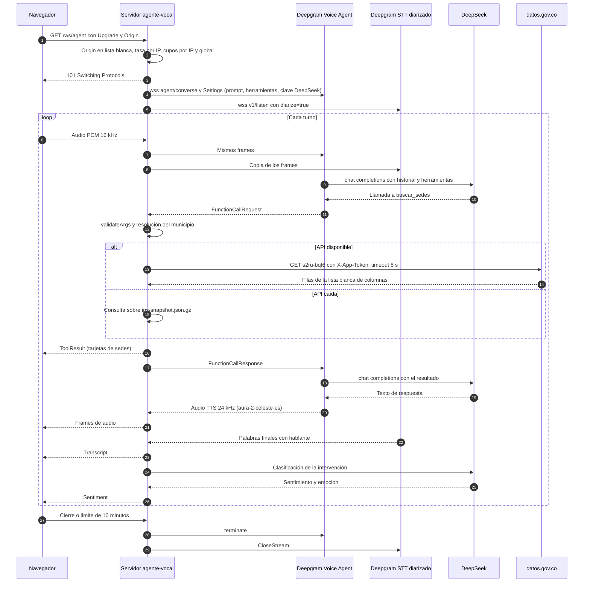

# Arquitectura visual

Diagramas de "¿Dónde me atienden?" generados como código con la librería `diagrams` (Python) sobre Graphviz. Fuente única: `docs/diagrams/code/build.py`. El detalle textual está en `docs/ARCHITECTURE.md`; aquí se muestra lo mismo en imágenes.

Colores comunes a todos los diagramas: naranja para el navegador (no confiable), azul para el borde de Google, verde para nuestro servidor (confiable), morado para terceros y gris para el plano de control de GCP. Las flechas azules son tráfico del usuario, las moradas voz y modelos, las verdes datos y herramientas, las rojas controles de seguridad o el camino de transcripción y sentimiento, y las punteadas caminos opcionales o de respaldo.

Regenerar (desde la raíz del repositorio, con Graphviz en el `PATH`):

```bash
pip install diagrams==0.25.1
python docs/diagrams/code/build.py
```

## 1. Vista general


La persona habla y escucha en el navegador (Next.js 15 y React 19), que abre HTTPS y el WebSocket `/ws/agent` hacia el servicio `agente-vocal` en Cloud Run. El servidor recibe sus secretos de Secret Manager al desplegar y es el único que habla con terceros: Deepgram Voice Agent (STT, TTS y orquestación, que piensa con DeepSeek), un segundo STT de Deepgram con diarización, DeepSeek para el brief y el sentimiento, datos.gov.co para las sedes y, si la persona acepta, WhatsApp. Google Maps es solo un enlace que la persona abre.

## 2. Contenedores y módulos


A la izquierda, la interfaz y `useVoiceSession` (AudioWorklet a 16 kHz, reproducción a 24 kHz). En el centro, el contenedor único Node 24: la entrada (Next.js, `limits.mjs` y el proxy `/ws/agent`), el documento (`documents.mjs` con almacén en memoria y `parse-worker.mjs` en un worker thread), voz y análisis (`agent-settings.mjs`, `diarize.mjs`, `sentiment.mjs`) y las herramientas del agente (`buscar_sedes` con caché y respaldo `ips-snapshot.json.gz`, `enviar_whatsapp` con límites). A la derecha, los terceros a los que llama cada módulo.

## 3. Flujo de una conversación de voz


Las flechas numeradas siguen un turno: el audio sube (1), el servidor envía `Settings` y audio a Deepgram Voice Agent (2), que transcribe y piensa con DeepSeek (3). Cuando el modelo decide buscar sedes, Deepgram envía `FunctionCallRequest` al servidor (4), que valida (5), consulta datos.gov.co o el snapshot (6a, 6b) y devuelve `FunctionCallResponse` a Deepgram (7). DeepSeek redacta la respuesta (8), Deepgram la sintetiza y el audio vuelve al servidor (9) y al parlante (10). En el turno de voz, solo Deepgram llama a DeepSeek; el servidor lo llama directamente solo para el brief y el sentimiento. En rojo, el camino paralelo: copia del audio al STT diarizado (11), intervención por hablante (12), clasificación con DeepSeek (13) y `Transcript` y `Sentiment` en pantalla (14).

La misma secuencia en Mermaid, que GitHub renderiza de forma nativa:



## 4. Despliegue y DevOps


El desarrollador hace `git push` a GitHub, donde GitHub Actions corre lint, pruebas, gitleaks, `npm audit` y build, sin desplegar. El despliegue lo hace `bash infra/deploy.sh` con `gcloud run deploy --source web`: Cloud Build (con su cuenta `agente-vocal-build`) construye la imagen `node:24-slim`, la guarda en Artifact Registry y Cloud Run crea una revisión nueva que corre como `agente-vocal-run`, con los secretos fijados a una versión concreta, máximo 2 instancias y logs JSON en Cloud Logging. El jurado entra por HTTPS y WSS con afinidad de sesión.

## 5. Seguridad y límites de confianza


De izquierda a derecha, las zonas: navegador no confiable, borde de Google (TLS), nuestro servidor y terceros, con el plano de control de GCP abajo. Cada flecha lleva el control que aplica al cruzar: lista blanca de Origin, tasa y cupos antes del handshake; subida de máximo 20 MB con tipo por firma (magic bytes) y extracción en un worker con tope de memoria; texto del documento cercado contra inyección de prompt; argumentos validados y literales SoQL escapados; mensaje de WhatsApp armado por el servidor. Las claves salen de Secret Manager solo hacia la memoria del proceso y nunca llegan al navegador.

## 6. Integración WhatsApp (RF-024)


La persona acepta y dicta su número; el audio llega al agente y el modelo pide `enviar_whatsapp` con `{telefono, sedes}`. El servidor valida el celular colombiano y hasta 3 posiciones, aplica los límites en memoria (1 por IP y 1 por número cada 10 minutos, 3 por hora en total) y arma el mensaje con la copia de la última búsqueda exitosa, de modo que el texto viene del registro y no del modelo. Luego envía la plantilla `sedes_salud_v1` a la Cloud API de Meta (8 s, sin reintento), que entrega el mensaje al celular.
