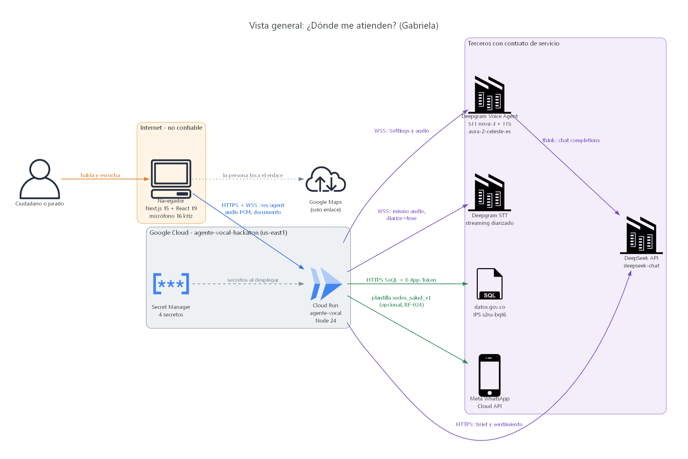
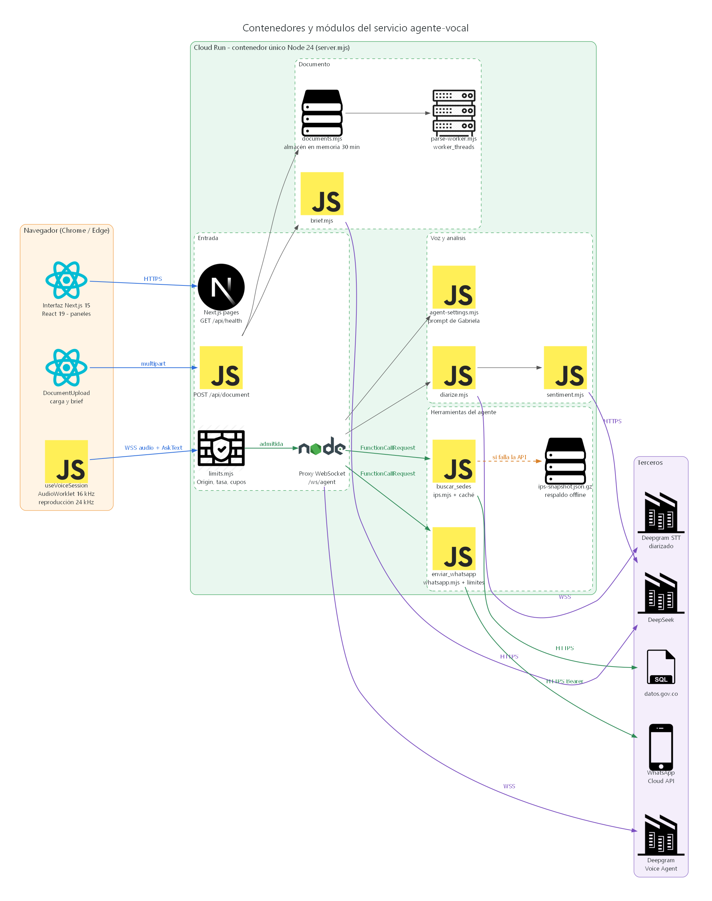
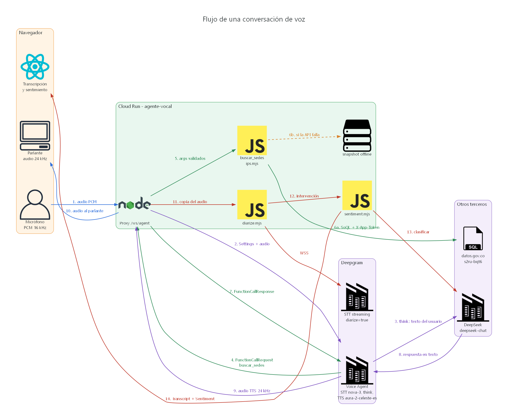
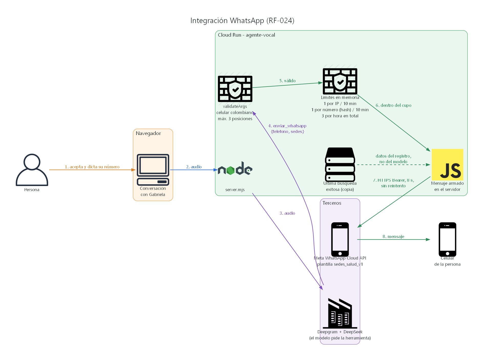
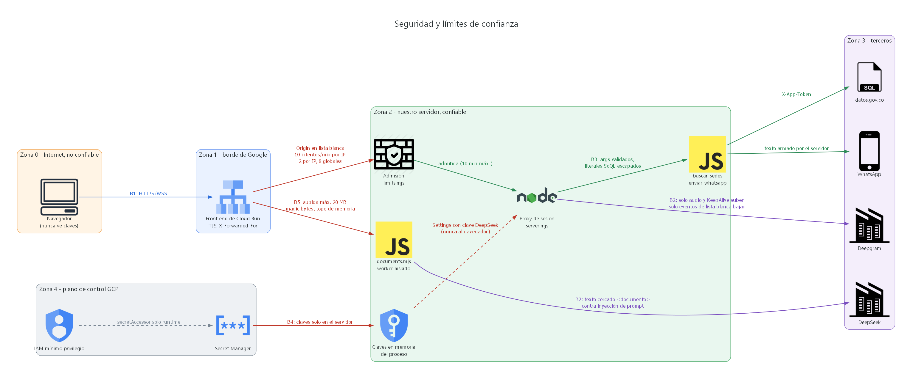
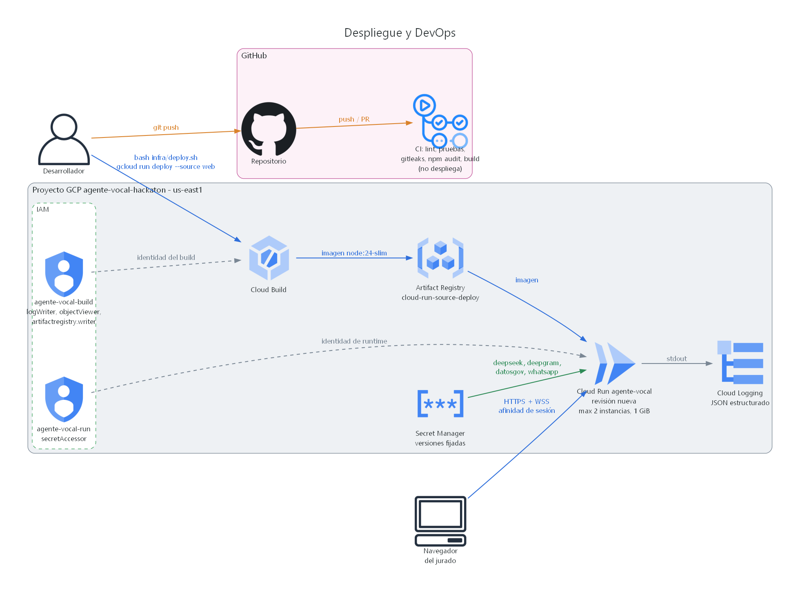

<!-- Generado desde docs/entregables/Arquitectura-y-DevOps.docx con docs/entregables/docx_to_md.py. Editar el script generador del .docx y regenerar. -->

**«¿Dónde me atienden?» - Agente vocal Gabriela**

Documento de arquitectura y DevOps

Reto 01 Agente Vocal Cognitivo, Kognia Labs (hackathon)

Fecha: 9 de octubre de 2026

Versión: 0.1.0 (web/package.json). Commit: f5005f4 docs: RF-005 barge-in criterion adjusted to 1.5 s; all 25 voice tests approved

**Presentado por Daniel Fajardo y Jacobo Jaramillo, en representación de SOLUTIONS TECH WEB SAS**

| Razón social | SOLUTIONS TECH WEB SAS |
|---|---|
| NIT | 902097724-2 |
| Tipo | Sociedad o persona jurídica principal o ESAL |
| Cámara de Comercio | Cámara de Comercio de Manizales |
| Matrícula | 254925 |
| Estado | Activa |

**Lista de secciones**

- 1. Resumen ejecutivo
- 2. Requerimientos y atributos de calidad
- 3. Arquitectura
- 4. Stack tecnológico y versiones
- 5. APIs y protocolos
- 6. Integraciones externas
- 7. Modelo de datos
- 8. Seguridad
- 9. DevOps
- 10. Capacidad y rendimiento
- 11. Pruebas
- 12. Riesgos conocidos y deuda técnica
- 13. Anexos

## 1. Resumen ejecutivo

Problema. Una persona en Colombia que necesita atención en salud no sabe en qué sede de su municipio la pueden atender. El registro oficial de prestadores existe (dataset IPS s2ru-bqt6 de datos.gov.co), pero no es usable por un ciudadano.

Solución. Gabriela es un agente de voz en español, accesible desde una URL pública sin instalar nada ni crear cuenta. La persona dice qué necesita y dónde está; el agente consulta en vivo el registro por API y responde con hasta 3 sedes por voz y hasta 20 en tarjetas con enlace a Google Maps. Si la persona sube un documento (orden médica, remisión o cualquier otro), el agente genera un brief con preguntas sugeridas y responde anclado al documento. La pantalla muestra la transcripción diarizada por hablante y el sentimiento de cada intervención. Opcionalmente envía las sedes por WhatsApp (RF-024).

**Tabla 1. Cifras clave**

| Indicador | Valor | Tipo |
|---|---|---|
| Latencia fin de voz a primer audio del agente | p50 2,0 s, p90 2,1 s (16 turnos, producción) | Medido |
| Carga HTTP (k6, 50 000 usuarios) | 51 749 recorridos, 103 498 peticiones, 0 errores, p95 191 ms | Medido |
| Punto de quiebre HTTP | Cerca de 1 200 peticiones/s ofrecidas; solo 429 de Cloud Run, sin 5xx | Medido |
| Sesiones de voz simultáneas | 8 por instancia, 16 en el servicio (max-instances 2) | Límite por diseño |
| Pruebas unitarias | 79 definidas: 75 pasan, 4 en vivo omitidas sin claves, 0 fallos | Medido |
| Requerimientos | 24 funcionales y 10 no funcionales; 85 casos de prueba | Documentado |
| Despliegue | Cloud Run, proyecto agente-vocal-hackaton, us-east1, servicio agente-vocal | Construido |

## 2. Requerimientos y atributos de calidad

Fuente: hoja 01 RETO de V2.xlsx, ADR 0001 y plan). R01 a R07 y la hoja 02 CRITERIOS no fueron entregadas; esos requerimientos se infirieron. La trazabilidad (requerimiento por prueba) está en docs/PRUEBAS.md.

### 2.1 Requerimientos funcionales

**Tabla 2. Requerimientos funcionales**

| ID | Requerimiento | Prioridad | Criterio de aceptación resumido |
|---|---|---|---|
| RF-001 | Carga de documento | Alta | PDF, DOCX, TXT hasta 20 MB; tipo por firma; 5 cargas/min y 1 simultánea por IP |
| RF-002 | Respuestas ancladas al documento | Alta | 6 de 7 preguntas correctas; sin mezclar conocimiento externo |
| RF-003 | Brief inicial | Alta | Resumen y 3 a 5 preguntas en 30 s o menos |
| RF-004 | Conversación por voz | Alta | p50 fin de voz a primer audio de 2,0 s o menos (objetivo 1,5 s), 10 turnos o más |
| RF-005 | Interrupción (barge-in) | Alta | Audio del agente cortado en 1,5 s o menos (ajustado desde 300 ms) |
| RF-006 | Honestidad | Alta | 3 de 3: dice que no sabe en lugar de inventar |
| RF-007 | Transcripción diarizada | Alta | Hablante y hora por intervención; 80 % o más con hablante correcto |
| RF-008 | Sentimiento y emociones | Media | Panel actualizado en 2 s o menos tras cerrar la intervención |
| RF-009 | Dataset IPS por API | Alta | 5 de 5 consultas coinciden con la API directa |
| RF-010 | Necesidad a tipo de atención | Alta | 15 categorías con lista fija; el modelo solo entrega el enum |
| RF-011 | Municipio aproximado | Alta | Resolución por nombre más parecido, sin tildes ni mayúsculas |
| RF-012 | Alternativa por departamento | Alta | Si no hay sedes en el municipio, ofrece las del departamento |
| RF-013 | Sin datos personales | Alta | Nunca gerente ni email; columnas en lista blanca |
| RF-014 | Emergencia primero | Alta | Primera frase "Llama al 123" en 5 de 5 |
| RF-015 | Una pregunta de orientación | Media | Una sola pregunta de gravedad; nunca diagnostica |
| RF-016 | Honestidad con especialidades | Alta | Dice que el registro no detalla especialidades |
| RF-017 | No mencionar fecha de corte | Media | Sin "noviembre", "2022" ni "fecha de corte" |
| RF-018 | Cita solo del documento | Media | "según tu documento" solo para datos del documento |
| RF-019 | Salida de sedes | Alta | Voz: máximo 3; pantalla: hasta 20 tarjetas |
| RF-020 | Fuera de la misión | Media | Redirige en una frase |
| RF-021 | Documento que no es de salud | Alta | Lo resume; no invoca sedes sin motivo |
| RF-022 | Sin diagnóstico ni comparaciones | Alta | 4 de 4 |
| RF-023 | Estilo de voz | Media | Máximo dos frases y una pregunta por turno |
| RF-024 | Envío opcional por WhatsApp | Media | Oferta única, confirmación 3-3-4, máx. 3 sedes; límites por IP, número y hora |

### 2.2 Requerimientos no funcionales y umbrales

**Tabla 3. Requerimientos no funcionales**

| ID | Requerimiento | Umbral verificable |
|---|---|---|
| RNF-001 | Despliegue público | URL HTTPS estable en Cloud Run us-east1, certificado válido |
| RNF-002 | Experiencia de usuario | Estados escuchando, pensando, hablando; 0 errores de consola |
| RNF-003 | Robustez y disponibilidad | /api/health 200 en menos de 500 ms; 100 % en la ventana del jurado; reconexión en 5 s o menos |
| RNF-004 | Seguridad del WebSocket y abuso | Rechazo de Origin ajeno, tercera sesión por IP, exceso de tasa y de cupo global, frames grandes, tipos desconocidos |
| RNF-005 | Cabeceras de seguridad | HSTS, CSP report-only, nosniff, DENY, Referrer-Policy, Permissions-Policy |
| RNF-006 | Secretos y exposición | Claves solo en servidor; /.env, /.git/config y source maps no responden 200; gitleaks limpio |
| RNF-007 | Rendimiento y carga | Smoke p95 < 800 ms; carga 20 VUs p95 < 1000 ms y error < 1 %; estrés 150 VUs p95 < 3000 ms y error < 5 %; picos error < 5 % |
| RNF-008 | README de una página | Un tercero levanta el proyecto en menos de 15 min |
| RNF-009 | Dependencias y repositorio limpios | npm audit --omit=dev con 0 vulnerabilidades; npm ci exitoso |
| RNF-010 | Regresión automatizada | node --test con 0 fallos antes de cada despliegue y merge |

### 2.3 Atributos de calidad priorizados

**Tabla 4. Atributos de calidad**

| Prioridad | Atributo | Cómo se logra |
|---|---|---|
| 1 | Latencia de conversación | Un solo salto de proxy; Deepgram Voice Agent hace STT, orquestación y TTS en streaming; audio crudo; región us-east1 |
| 2 | Seguridad de las claves | El mensaje Settings lo arma solo el servidor; secretos en Secret Manager |
| 3 | Control de costo | Admisión antes del handshake, sesión de 10 min, max-instances 2 |
| 4 | Honestidad | Prompt con reglas del ADR 0001, herramienta con salida estructurada, temperature 0,2 |

## 3. Arquitectura

### 3.1 Estilo: monolito modular

Un solo proceso Node 24 en un solo contenedor sirve las páginas Next.js, la carga de documentos y el proxy de voz WebSocket. Cada dominio es un módulo con API pública explícita; server.mjs solo usa sus exports. Sin base de datos: el estado vive en memoria por sesión. Razón: con 2 personas y tiempo de hackathon, los microservicios agregan red, despliegues múltiples y fallos parciales sin aportar valor; las fronteras ya permiten extraer servicios después (primer candidato: el gateway de voz).

**Tabla 5. Registro de decisiones de arquitectura**

| ADR | Decisión |
|---|---|
| 0001 Misión del agente | Ayudar a encontrar en qué sede de su municipio recibir la atención necesaria, con el registro oficial y el documento opcional |
| 0002 Stack y monolito modular | Node 24 + Next.js 15.5 + ws en un proceso; módulos con interfaz explícita; sin base de datos |
| 0003 Despliegue en Cloud Run | Servicio agente-vocal, us-east1, timeout 3600 s, afinidad de sesión, max-instances 2, concurrency 40 |
| 0004 Acceso público sin login | allow-unauthenticated; el WebSocket (lo único con costo) se protege con Origin, cupos, tasa y duración |

### 3.2 Contexto del sistema

*Figura 1. Contexto del sistema.*

### 3.3 Contenedores y módulos

*Figura 2. Contenedores y módulos.*

**Tabla 6. Módulos**

| Módulo | Archivo | Responsabilidad | API pública |
|---|---|---|---|
| Servidor y proxy de voz | web/server.mjs | Arranca Next.js, upgrade a /ws/agent, una conexión a Deepgram por sesión, filtra mensajes en ambos sentidos, ejecuta funciones, POST /api/document, logs | HTTP en PORT; WSS /ws/agent |
| Admisión | web/server/limits.mjs | Lista blanca de Origin, IP del cliente (última de X-Forwarded-For), cupo por IP, cupo global, tasa por minuto; IPv6 por /64 | createLimiter({perIp, global, ratePerMin}).admit(ip); isAllowedOrigin; clientIp |
| Configuración del agente | web/server/agent-settings.mjs | Persona Gabriela, prompt del ADR 0001, modelos, formatos de audio, saludo; documento cercado como datos | buildSettings({deepseekKey, documentText}); IN_RATE 16000; OUT_RATE 24000; VOICE; BASE_PROMPT |
| Herramienta de sedes | web/server/ips.mjs | Valida argumentos, resuelve municipio, SoQL con literales escapados, paginación, agregación por sede, caché y respaldo local | buscarSedes(args, {token}); TOOL_DEFINITION; validateArgs; resolveMunicipio |
| Documentos | web/server/documents.mjs, parse-worker.mjs | Tipo por firma, extracción en worker thread (unpdf, fflate), almacén en memoria con vencimiento | parseDocument; createDocumentStore; MAX_BYTES |
| Brief | web/server/brief.mjs | Resumen y 3 a 5 preguntas con DeepSeek (25 s) | generateBrief |
| Diarización | web/server/diarize.mjs | Segundo STT con diarize=true; agrupa palabras por hablante | createDiarizer({apiKey, onTurn, log}).send/close; groupWords |
| Sentimiento | web/server/sentiment.mjs | Una llamada a DeepSeek por intervención, JSON validado contra listas cerradas | classifySentiment(text, {apiKey}) |
| WhatsApp (opcional) | web/server/whatsapp.mjs | Herramienta enviar_whatsapp: validación, límites, plantilla sedes_salud_v1 | createWhatsApp(...).send; validateArgs; TOOL_DEFINITION |
| Páginas y salud | web/src/app/ | Interfaz React y GET /api/health | GET /; GET /api/health |
| Sesión de voz del navegador | web/src/app/components/useVoiceSession.ts | Micrófono por AudioWorklet a 16 kHz, reproducción 24 kHz, barge-in, AskText | useVoiceSession(documentId, onSedes) |
| Componentes de interfaz | web/src/app/components/ | GabrielaStage, Waveform, TranscriptPanel, SentimentPanel, DocumentUpload, SedesPanel | Props de React |

### 3.4 Flujo de datos de una conversación

*Figura 3. Secuencia de un turno de voz.*

1. Captura: useVoiceSession crea un AudioContext a 16 kHz; el AudioWorklet public/pcm-capture.js convierte Float32 a PCM de 16 bits y envía frames de 40 ms (640 muestras, 1280 bytes).
1. Conexión: el navegador abre WSS /ws/agent (opcional ?doc=<id>). El servidor aplica, en orden, Origin (403), documento vigente si hay doc (404), tasa por IP 10/min (429), cupo global 8 (503) y cupo por IP 2 (429, Retry-After 60).
1. Proxy: el servidor abre wss://agent.deepgram.com/v1/agent/converse con Authorization: Token y envía Settings: entrada linear16 16 kHz, salida linear16 24 kHz sin contenedor, STT nova-3 español con keyterms IPS, EPS y urgencias, LLM deepseek-chat (temperature 0,2) en api.deepseek.com, herramientas y voz aura-2-celeste-es. Hasta 50 frames previos se guardan.
1. Turno: el audio se reenvía sin modificar; Deepgram detecta el fin de turno, transcribe y llama a DeepSeek. Si el modelo pide buscar_sedes, llega FunctionCallRequest; el servidor ejecuta, envía ToolResult al navegador (tarjetas) y FunctionCallResponse a Deepgram.
1. buscar_sedes: validateArgs; municipio resuelto contra la lista oficial (precargada al arrancar); consulta SoQL a s2ru-bqt6 con X-App-Token, páginas de 1000 filas, tope 5000, 8 s por petición, un reintento ante 5xx, presupuesto de API de 6,5 s y plazo total de 12 s. Si la API falla, respaldo: copia local comprimida web/server/data/ips-snapshot.json.gz (columnas en lista blanca, generada con web/scripts/snapshot-ips.mjs), evento ips_fallback. Caché en memoria de consultas exitosas (hasta 500).
1. Respuesta: DeepSeek redacta (máximo dos frases), Deepgram sintetiza audio de 24 kHz; el servidor reenvía audio y solo los eventos de la lista blanca.
1. Diarización: el mismo audio va a wss://api.deepgram.com/v1/listen (nova-3, es, diarize=true, endpointing 300, utterance_end_ms 1000). Las palabras finales se agrupan por hablante (mismo hablante si el hueco es menor a 1 s) y se emiten como Transcript. Descarta frames si el socket acumula más de 1 MiB; KeepAlive cada 5 s.
1. Sentimiento: cada intervención de 2 palabras o más se clasifica con DeepSeek (temperature 0, JSON, 4 s, máximo 2 en curso por sesión) y se envía Sentiment con el mismo id.
1. Documento: POST /api/document con el binario; tipo por firma, extracción en worker (192 MB de heap, 10 s), texto hasta 20 000 caracteres en memoria 30 min (máximo 100 documentos); brief con DeepSeek en 25 s; la sesión de voz recibe el texto cercado entre <documento> y </documento>.
1. WhatsApp (RF-024): herramienta enviar_whatsapp solo si WHATSAPP_ACCESS_TOKEN y WHATSAPP_PHONE_NUMBER_ID existen. Valida {telefono, sedes} (celular colombiano, máximo 3 posiciones de la última búsqueda); el servidor arma el mensaje desde su copia de la última búsqueda; plantilla sedes_salud_v1; 8 s sin reintento; 1 por IP y 1 por número cada 10 min, 3 por hora en total.
1. Barge-in: Deepgram emite UserStartedSpeaking y el navegador detiene y vacía el audio del agente en cola.
1. Cierre: por el navegador (1000), por Deepgram (1011) o a los 10 min (4000); se libera el cupo y se registra session_end.

*Figura 4. Integración WhatsApp (RF-024).*

### 3.5 Límites de confianza

*Figura 5. Límites de confianza.*

**Tabla 7. Fronteras de confianza**

| Frontera | Qué cruza | Control |
|---|---|---|
| B1 navegador a servidor | Upgrade, audio, texto | Origin, cupos y tasa antes del handshake; frames > 64 KB cierran con 1009; solo KeepAlive y AskText (1 a 300 caracteres, 20 por sesión) reconstruidos por el servidor; otro texto cierra con 1008 |
| B2 servidor y Deepgram | Settings, audio, KeepAlive, InjectUserMessage, FunctionCallResponse; eventos | Solo bajan siete tipos de evento, ToolResult, Transcript, Sentiment y un Error saneado |
| B2 bis Deepgram y DeepSeek | Texto y clave de DeepSeek | Riesgo aceptado; clave dedicada al evento y revocada al desmontar |
| B3 modelo a consulta | Argumentos de herramienta | validateArgs: campos desconocidos, 60 caracteres, control, enums; municipio oficial; soqlString; columnas en lista blanca |
| B4 plano de control | Secretos e imagen | Secret Manager con versión fijada; agente-vocal-run solo secretAccessor; .dockerignore excluye .env* |
| B5 archivo subido | Cuerpo y texto extraído | Firma real, 20 MB reales, 20 s de cuerpo, worker con límites, cercado como datos |
| B6 servidor a Meta | Plantilla con dos parámetros | Destino constante graph.facebook.com; texto armado por el servidor |

### 3.6 Vista de despliegue

*Figura 6. Despliegue.*

## 4. Stack tecnológico y versiones

**Tabla 8. Stack**

| Componente | Versión exacta | Fuente |
|---|---|---|
| Node.js (imagen) | node:24-slim (build y runtime) | web/Dockerfile |
| Next.js | 15.5.27 | package.json / lockfile |
| React y React DOM | 19.1.0 | package.json / lockfile |
| ws (WebSocket) | 8.22.0 | package.json / lockfile |
| unpdf (PDF) | 1.8.1 | package.json / lockfile |
| fflate (DOCX/ZIP) | 0.8.3 | package.json |
| TypeScript | 5.9.3 (rango ^5) | lockfile |
| Tailwind CSS | 4.3.3 (rango ^4) | lockfile |
| ESLint | 9.39.5 (rango ^9), eslint-config-next 15.5.27 | lockfile |
| postcss (override) | 8.5.29 | package.json overrides |
| Pruebas unitarias | node:test (stdlib de Node) | npm test |
| Pruebas de carga | k6 2.2.0 (imagen grafana/k6:2.2.0) | sección 10 de este documento |
| STT | Deepgram nova-3, español | agent-settings.mjs, diarize.mjs |
| LLM | DeepSeek deepseek-chat (endpoint compatible OpenAI) | agent-settings.mjs |
| TTS | Deepgram aura-2-celeste-es | agent-settings.mjs |
| Datos | datos.gov.co SODA2, dataset s2ru-bqt6 | ips.mjs |
| Nube | Google Cloud Run, Cloud Build, Artifact Registry, Secret Manager, Cloud Logging | infra/deploy.sh |

## 5. APIs y protocolos

Contratos: docs/api/openapi.yaml (HTTP, con x-requirement por operación) y docs/api/websocket-protocol.md.

### 5.1 Endpoints HTTP

**Tabla 9. Endpoints**

| Método y ruta | Propósito | Respuestas | Requerimientos |
|---|---|---|---|
| GET / | Interfaz web (Next.js) | 200 | RNF-001, RNF-002 |
| GET /api/health | Verificación de salud; sondas de Cloud Run | 200 | RNF-003, RNF-001 |
| POST /api/document | Sube documento (binario en bruto, máx. 20 MB) y devuelve brief | 201 {documentId, tipo, caracteres, truncado, brief}; 400, 403, 413, 415, 422, 429, 500 | RF-001, RF-003, RNF-004 |
| GET /ws/agent | Upgrade a WebSocket de voz; ?doc=<uuid> opcional | 101; 403, 404, 429 (Retry-After 60), 503 | RF-002, RF-004, RF-005, RF-009, RF-019, RNF-004 |

Errores de carga: {"error": código, "mensaje": texto} con códigos origen_no_permitido, vacio, demasiado_grande, tipo_no_soportado, sin_texto, demasiadas_cargas, error_interno. Límites de carga: 5 por minuto y 1 simultánea por IP, 4 globales por instancia, 20 s para recibir el cuerpo.

### 5.2 WebSocket: navegador a servidor

**Tabla 10. Mensajes de entrada**

| Frame | Contenido | Acción del servidor |
|---|---|---|
| Binario | PCM linear16, 16 kHz, mono, máx. 64 KB | Reenvía al agente y al STT diarizado; buffer de 50 frames antes de abrir Deepgram |
| Texto | {"type":"KeepAlive"} | Reescrito en forma canónica y reenviado |
| Texto | {"type":"AskText","text":"..."} | 1 a 300 caracteres, máximo 20 por sesión; reconstruido como InjectUserMessage |
| Texto | Cualquier otro | Cierra con 1008 invalid_message |

### 5.3 WebSocket: servidor a navegador

**Tabla 11. Mensajes de salida**

| Tipo | Origen | Uso |
|---|---|---|
| Binario | Deepgram | Audio PCM linear16 24 kHz mono |
| Welcome, SettingsApplied | Deepgram | Conexión lista |
| ConversationText | Deepgram | Texto por rol (user, assistant) |
| UserStartedSpeaking | Deepgram | Estado escuchando y barge-in |
| AgentThinking, AgentStartedSpeaking, AgentAudioDone | Deepgram | Estados pensando y hablando |
| ToolResult | Servidor | Tarjetas de sedes (hasta 20) |
| Transcript | Servidor | {id, speaker, text, start, end} diarizado |
| Sentiment | Servidor | {id, sentimiento, emocion, intensidad} |
| Error | Servidor | Texto fijo genérico; la sesión sigue |

### 5.4 Códigos de cierre y límites

**Tabla 12. Códigos de cierre**

| Código | Razón | Causa |
|---|---|---|
| 1000 | client_closed | El usuario terminó |
| 1008 | invalid_message | Texto no permitido |
| 1009 | (librería ws) | Frame mayor a 64 KB |
| 1011 | upstream_closed, upstream_error, client_error | Deepgram cerró o falló, o error del socket del navegador |
| 4000 | session_time_limit | Sesión de 10 min (SESSION_MAX_MS) |

Errores de la herramienta buscar_sedes: parametros_invalidos, municipio_no_encontrado (con hasta 3 sugerencias), servicio_no_disponible, funcion_desconocida. Errores de enviar_whatsapp: no_disponible y límites superados.

## 6. Integraciones externas

**Tabla 13. Integraciones**

| Integración | Propósito | Protocolo y autenticación | Timeout | Reintentos | Plan ante falla |
|---|---|---|---|---|---|
| Deepgram Voice Agent | STT, orquestación LLM y TTS del turno | WSS agent/converse; Authorization: Token | Handshake 10 s; sesión 10 min | Ninguno | Cierra con 1011; la interfaz ofrece reconectar; la carga de documento sigue |
| Deepgram STT v1/listen | Transcripción diarizada | WSS; Authorization: Token | KeepAlive 5 s; descarte > 1 MiB | Ninguno | Se pierden Transcript y Sentiment; la voz sigue; respaldo con ConversationText |
| DeepSeek vía Deepgram | Respuesta del agente | HTTPS; clave entregada en Settings | Lo impone Deepgram | Lo decide Deepgram | Error saneado al navegador |
| DeepSeek directo (brief) | Resumen y preguntas | HTTPS; Bearer | 25 s | Ninguno | 201 con brief nulo |
| DeepSeek directo (sentimiento) | Clasificación por intervención | HTTPS; Bearer | 4 s | Ninguno | Intervención sin emoción; sentiment_failed |
| datos.gov.co s2ru-bqt6 | Sedes IPS | HTTPS SoQL; X-App-Token | 8 s por petición; 6,5 s de API; 12 s total | 1 ante 5xx | Respaldo con copia local comprimida; si todo falla, servicio_no_disponible y el agente dice que no sabe |
| Meta WhatsApp Cloud API (opcional) | Envío de sedes (RF-024) | HTTPS POST /messages; Bearer | 8 s | Ninguno | no_disponible; Gabriela lo explica en una frase |
| Secret Manager | Claves | API de GCP al desplegar; identidad agente-vocal-run | No aplica | No aplica | Sin secreto el proceso termina (código 1) y la revisión no arranca |

## 7. Modelo de datos

No hay base de datos. Todo el estado vive en memoria de la instancia y se pierde al reciclarla. El detalle por almacén está en la tabla siguiente.

**Tabla 14. Almacenes en memoria**

| Almacén | Contenido | Vida y límites |
|---|---|---|
| Documentos (documents.mjs) | id UUID v4, tipo (pdf, docx, txt), texto hasta 20 000 caracteres | 30 min; máximo 100 entradas; nunca en disco |
| Limitador (limits.mjs) | Sesiones activas por IP, intentos del último minuto, total global | Poda cada minuto; IPv6 por /64 |
| Sesión (runSession) | id, hash de IP, texto del documento, conexiones, buffer de 50 frames, temporizador | Hasta 10 min; se descarta al cerrar |
| Caché de ips.mjs | Lista de municipios y consultas exitosas (hasta 500) | Vida del proceso; sin datos de usuarios |
| Copia del registro | web/server/data/ips-snapshot.json.gz, columnas en lista blanca | Archivo de la imagen; tan fresco como su última regeneración |
| Ventanas WhatsApp | Hash de IP o /64, SHA-256 del número (12 hex), envíos de la última hora, última búsqueda | 10 min por IP y por número; 1 hora global |
| Logs | Eventos JSON sin datos personales | Retención por defecto de Cloud Logging; se borran con el proyecto |

Datos sensibles: audio (solo en tránsito hacia Deepgram), texto de documentos (memoria 30 min), número de WhatsApp (solo hash en memoria y logs). IP registrada como SHA-256 truncado a 12 caracteres. Nunca se seleccionan las columnas gerente ni email del registro. Nada se cifra en reposo porque nada se guarda.

## 8. Seguridad

### 8.1 Modelo de amenazas

**Tabla 15. Amenazas**

| Activo o actor | Riesgo | Mitigación principal |
|---|---|---|
| Claves de proveedores | Robo y uso como proxy gratuito | Solo en servidor y Secret Manager; Settings armado por el servidor |
| Presupuesto | Abuso de sesiones facturadas | Admisión antes del handshake, 16 sesiones de techo, 10 min por sesión |
| Disponibilidad | Bloqueo del event loop compartido | Extracción de documentos en worker thread con límites |
| Documento hostil | Inyección de instrucciones | Cercado con fenceSafe; texto tratado como datos |
| Modelo de lenguaje | Argumentos maliciosos | validateArgs, enums, municipio oficial, soqlString |
| Script fuera del navegador | Origin y X-Forwarded-For falsificados | Solo la última entrada de X-Forwarded-For; cupos y tasa |
| WhatsApp | Spam o texto arbitrario | Confirmación 3-3-4, límites por número e IP, plantilla fija armada por el servidor |

### 8.2 Controles implementados

- Cabeceras (web/next.config.mjs): Strict-Transport-Security max-age=63072000; includeSubDomains; X-Content-Type-Options nosniff; X-Frame-Options DENY; Referrer-Policy strict-origin-when-cross-origin; Permissions-Policy camera=(), geolocation=(), payment=(), usb=(), microphone=(self); poweredByHeader desactivado; sin source maps de navegador.
- CSP en modo report-only: default-src 'self'; script-src y style-src 'self' 'unsafe-inline'; img-src 'self' data: blob:; connect-src 'self'; media-src y worker-src 'self' blob:; frame-ancestors 'none'; base-uri y form-action 'self'; object-src 'none'.
- Lista blanca de Origin (ALLOWED_ORIGINS); vacía en producción rechaza todo upgrade; upgrade a otra ruta se corta. Sin cabeceras CORS.
- Límites: WebSocket 10 intentos/min por IP, 2 sesiones por IP, 8 globales por instancia, 10 min; carga 5/min, 1 simultánea por IP, 4 globales; frames de 64 KB; AskText 300 caracteres y 20 por sesión.
- Carga de archivos: tipo por firma (PDF, DOCX con word/document.xml, TXT UTF-8 sin NUL), 20 MB contados en bytes reales, nombre ignorado, id UUID, solo memoria, worker con 192 MB de heap y 10 s, XML de DOCX hasta 8 MB.
- Inyección de instrucciones: documento entre <documento> y </documento> e intervención entre <intervencion> y </intervencion>, neutralizando cualquier grafía de la etiqueta (fenceSafe); salida del sentimiento validada contra listas cerradas; brief saneado (resumen 600, preguntas 200).
- Anti SSRF: destinos salientes constantes en el código.
- Errores genéricos al cliente; detalle solo en logs. No se registran transcripciones, audio, documentos ni argumentos.
- Secretos: Secret Manager con versión fijada por revisión; .env fuera de git y de la imagen; contenedor no root.

### 8.3 Resultados de auditoría

**Tabla 16. Hallazgos corregidos**

| Hallazgo | Corrección (commit 050e436) |
|---|---|
| H1 bomba de descompresión DOCX | Worker con 192 MB y 10 s; XML hasta 8 MB |
| H2 bomba de descompresión PDF | Mismo worker con límites |
| H3 slowloris en subida | Presupuesto absoluto de 20 s para el cuerpo |
| M1 cerco del documento rompible | fenceSafe neutraliza variantes de la etiqueta |
| M2 limitador sin poda y evasión IPv6 | Poda por minuto y clave por /64 |

Verificado en producción (registro de pruebas en el historial de git de docs/TESTING.md, commit 6eb3dd7): Origin ajeno 403, tercera sesión 429, frame de 65 KB cierra con 1009, texto desconocido 1008; cabeceras presentes; /.env, /.git/config, /package.json, /server.mjs y .map responden 404; sin violaciones CSP; gitleaks limpio y npm audit con 0 vulnerabilidades. Pendientes: parte de CP-044 a CP-065 y el break test manual.

### 8.4 Deuda de seguridad

- CSP en report-only con 'unsafe-inline'; pasar a nonces y modo bloqueo.
- Limitadores en memoria por instancia: cupos efectivos se multiplican por instancias (16 sesiones, 4 por IP).
- documentId en la URL ?doc= queda en logs de peticiones de Cloud Run.
- Sin alerta de presupuesto (la debe crear el administrador de facturación).
- Clave de DeepSeek visible para Deepgram por diseño de la Voice Agent API.
- Token de WhatsApp de larga duración: rotar y revocar al terminar el evento.
- Sin bloqueo progresivo ni rate limit en páginas HTTP.

## 9. DevOps

### 9.1 Repositorio y flujo de trabajo

- Git con ramas cortas por tarea; mensajes en formato Conventional Commits (feat, fix, docs, refactor, test, chore, security).
- Cada cambio que afecte el comportamiento actualiza docs/PRUEBAS.md con su prueba y resultado.
- Definición de hecho: funciona, tiene prueba, pasa lint, sin secretos, documentado si cambió el contrato.
- Trazabilidad: commits, operaciones OpenAPI (x-requirement) y pruebas referencian el ID RF o RNF.

### 9.2 Integración continua (.github/workflows/ci.yml)

Disparadores: push y pull_request. Permisos: contents: read. Concurrencia: grupo ci-<ref> con cancelación de corridas previas. Acciones fijadas por SHA de commit. La CI no despliega: no hay credenciales de GCP en GitHub.

**Tabla 17. Jobs de CI**

| Job | Configuración | Pasos |
|---|---|---|
| test | ubuntu-latest, 15 min, directorio web | actions/checkout v7.0.1; actions/setup-node v7.1.0 (Node 24, caché npm); npm ci; npm run lint; npm test; npm audit --omit=dev --audit-level=high; npm run build |
| secrets-scan | ubuntu-latest, 10 min, pull-requests: read | actions/checkout v7.0.1 con fetch-depth 0 (historial completo); gitleaks/gitleaks-action v3.0.0 con GITHUB_TOKEN y comentarios desactivados |

### 9.3 Dependencias y escaneo de secretos

package-lock.json y npm ci; dependencias de producción con versión exacta; override de postcss 8.5.29; npm audit sin vulnerabilidades altas o críticas en producción; gitleaks sobre todo el historial en cada push. Toda dependencia nueva se verifica en el registro oficial antes de instalarla.

### 9.4 Construcción (web/Dockerfile)

- Etapa build: node:24-slim; npm ci --no-audit --no-fund; npm run build; npm prune --omit=dev.
- Etapa runtime: node:24-slim, NODE_ENV=production; copia package.json, node_modules, .next, public, server.mjs, next.config.mjs y server/ con propietario node.
- USER node (no root), EXPOSE 8080, PORT=8080, CMD node server.mjs. Sin secretos en capas; .dockerignore excluye .env*.

### 9.5 Despliegue en Cloud Run (infra/deploy.sh)

Script idempotente que se ejecuta desde la raíz: bash infra/deploy.sh. Pasos: (1) habilita run, cloudbuild, artifactregistry y secretmanager; (2) crea las cuentas agente-vocal-run y agente-vocal-build si faltan; (3) da a la cuenta de ejecución roles/secretmanager.secretAccessor solo sobre sus secretos; (4) da a la cuenta de build roles/logging.logWriter, roles/storage.objectViewer y roles/artifactregistry.writer; (5) quita el rol Editor a la cuenta de cómputo por defecto; (6) fija cada secreto a su versión habilitada más reciente; (7) gcloud run deploy --source web; (8) smoke check con curl a /api/health.

**Tabla 18. Configuración de Cloud Run**

| Parámetro | Valor |
|---|---|
| Proyecto / región / servicio | agente-vocal-hackaton / us-east1 / agente-vocal |
| URL | https://agente-vocal-<número de proyecto>.us-east1.run.app |
| Acceso | --allow-unauthenticated (ADR 0004) |
| Instancias | --min-instances ${MIN_INSTANCES:-0} (1 durante la evaluación), --max-instances 2 |
| Concurrencia | --concurrency 40 |
| Afinidad y timeout | --session-affinity, --timeout 3600 |
| Recursos | --cpu 1, --memory 1Gi |
| Sonda de arranque | httpGet /api/health:8080, periodSeconds 2, failureThreshold 15, timeoutSeconds 2 |
| Sonda de vida | httpGet /api/health:8080, periodSeconds 30, failureThreshold 3, timeoutSeconds 3 |
| Cuenta de ejecución | agente-vocal-run (solo secretAccessor) |
| Cuenta de build | agente-vocal-build (logWriter, objectViewer, artifactregistry.writer) |
| Imagen | Artifact Registry cloud-run-source-deploy, us-east1 |
| Secretos (nombres) | deepgram-api-key, deepseek-api-key, datosgov-app-token y, opcional, whatsapp-access-token; replicación user-managed en us-east1; versión fijada |

### 9.6 Variables de entorno (solo nombres)

**Tabla 19. Variables de entorno**

| Variable | Uso |
|---|---|
| DEEPGRAM_API_KEY, DEEPSEEK_API_KEY | Obligatorias (Secret Manager); sin ellas el proceso termina con código 1 |
| DATOSGOV_APP_TOKEN | Opcional; sin él datos.gov.co aplica límites más bajos |
| ALLOWED_ORIGINS | Lista de orígenes permitidos; en producción, vacía rechaza todo |
| SESSION_MAX_MS, MAX_SESSIONS, MAX_SESSIONS_PER_IP, MAX_CONNECTS_PER_MIN | Opcionales; por defecto 600 000, 8, 2 y 10 |
| PORT, NODE_ENV | 8080 y production en la imagen |
| WHATSAPP_ACCESS_TOKEN, WHATSAPP_PHONE_NUMBER_ID | Opcionales; activan RF-024 |
| WHATSAPP_API_VERSION, WHATSAPP_MAX_PER_HOUR, WHATSAPP_BUSINESS_ACCOUNT_ID | v25.0, 3 y solo gestión de plantillas |
| LIVE | Solo pruebas: activa las pruebas en vivo |

### 9.7 Observabilidad

Una línea JSON por evento en stdout con campo severity, leída por Cloud Logging sin agente. El id de sesión (UUID) es el identificador de correlación. Métricas de peticiones, latencia, instancias y memoria vienen de Cloud Run. Sin trazas distribuidas (un solo servicio).

**Tabla 20. Eventos de log**

| Evento | Severidad | Campos |
|---|---|---|
| server_listening | INFO | port, dev, número de orígenes |
| ws_rejected | INFO | reason (bad_origin, doc_not_found, rate_limited, ip_cap, global_cap), status, id, ip (hash) |
| session_start / session_end | INFO | id, ip (hash), document / code, reason, seconds |
| document_uploaded / upload_failed | INFO / ERROR | ip (hash), tipo, caracteres, truncado, brief, ms / detail |
| tool_call | INFO | id, name, error, total |
| ips_fallback | WARNING | reason (uso de la copia local) |
| buscar_sedes_failed | ERROR | reason |
| diarize_end / diarize_error | INFO | id, turns / reason |
| sentiment_failed / brief_failed | ERROR | reason (timeout, network, http_<código>, invalid_json, invalid_shape) |
| whatsapp_sent / whatsapp_failed | INFO / ERROR | hash del número |
| upstream_error / upstream_socket_error | ERROR | id, detail |

### 9.8 Rollback

Cloud Run conserva las revisiones anteriores. Para volver atrás: gcloud run services update-traffic agente-vocal --to-revisions=<revisión>=100 --region us-east1 --project agente-vocal-hackaton. Como no hay estado persistente ni migraciones, el rollback es inmediato; las sesiones abiertas en la revisión retirada se pierden y el usuario reconecta.

### 9.9 Costos y desmontaje

- min-instances 0 fuera de la ventana del jurado; max-instances 2 como techo de costo; 1 vCPU y 1 GiB.
- Costo dominante: minutos de Deepgram (agente y STT diarizado) y turnos de DeepSeek por sesión; WhatsApp por mensaje.
- Alerta de presupuesto pendiente (cuenta de facturación compartida).
- Desmontaje al terminar el evento: gcloud projects delete agente-vocal-hackaton y revocación de las claves de Deepgram, DeepSeek, datos.gov.co y el token de WhatsApp (sección 9.9 de este documento).

## 10. Capacidad y rendimiento

### 10.1 Medido: carga HTTP con k6

2026-10-09, k6 2.2.0 contra el despliegue real (max-instances 2, concurrency 40). Cada recorrido: GET /, pausa de 0,3 a 0,7 s y GET /api/health. No se abrieron WebSockets ni se subieron documentos (costo).

**Tabla 21. Resultados de carga**

| Prueba | Resultado medido |
|---|---|
| Capacidad 50 000 usuarios (users-50k.js) | 51 749 recorridos, 103 498 peticiones en 5,8 min; 0 errores; mediana 91,7 ms, p90 130 ms, p95 191 ms, máximo 1,66 s; unas 320 peticiones/s en meseta |
| Estrés (PHASE=stress) | Primeros 429 cerca de 1 200 peticiones/s ofrecidas; pico servido unas 770/s 2xx; sin 5xx; recuperación al bajar la carga |
| Smoke (smoke.js) | p95 170 ms |
| Carga 20 VUs (load.js) | p95 360 ms |
| Estrés 150 VUs (stress.js) | p95 252 ms, 0 errores |
| Picos 120 VUs (spike.js) | p95 176 ms |
| Límites del WebSocket (ws-limits.js) | Todos los excedentes rechazados |

### 10.2 Proyectado (no verificado)

- Unas 160 peticiones/s cómodas por instancia y unas 380 de pico.
- Voz: 8 sesiones por instancia, 16 en total, unas 96 sesiones por hora con sesiones de 10 min. Límite por diseño, no medido; dependen además de la concurrencia de Deepgram y del límite de DeepSeek.
- 100 000 usuarios: al día, cubierto con margen; en 6 minutos, unas 6 instancias; con 1 % hablando a la vez, unas 125 instancias y Memorystore para limitador y documentos, CDN para estáticos y planes mayores en Deepgram y DeepSeek.

### 10.3 Latencia de voz

Medido en producción el 2026-10-09 a las 13:45 sobre 16 turnos en dos sesiones: desde el fin de la voz del usuario hasta el primer audio del agente.

**Tabla 22. Latencia de voz medida**

| Métrica | Valor |
|---|---|
| p50 | 2,0 s |
| p90 | 2,1 s |
| Mínimo | 1,97 s |
| Máximo | 3,7 s (un turno) |
| Desglose aproximado | ~0,5 s detección de fin de turno (Deepgram) + ~1,5 s LLM (DeepSeek) e inicio del TTS |

Cumple el umbral de RF-004 (p50 de 2,0 s o menos); el objetivo de 1,5 s no se alcanza. El LLM es el componente dominante, por eso el prompt limita las respuestas a dos frases. Un turno con herramienta suma el tiempo de datos.gov.co (hasta 12 s de plazo). Falta repetir la medición con micrófono real.

#### Interrupción (barge-in)

Medido en producción sobre 6 interrupciones con el agente hablando: del inicio de la voz de la persona al evento UserStartedSpeaking pasan de 1,07 a 1,11 s (p50 1,09 s); el navegador descarta el audio en cola al recibirlo y el agente atendió la nueva frase en los 6 casos. Cumple el criterio de RF-005, ajustado de 300 ms a 1,5 s porque la espera es la detección de voz de Deepgram más la red. Mejora futura: detección local de voz en el navegador. Detalle en el reporte de pruebas de audio.

## 11. Pruebas

**Tabla 23. Resumen de pruebas**

| Tipo | Ubicación | Resultado |
|---|---|---|
| Unitarias (node:test) | web/server/*.test.mjs | 79 definidas: 75 pasan, 4 en vivo omitidas sin LIVE=1 y claves, 0 fallos |
| Integración contra producción | web/tests/integration/proxy.test.mjs | 18 pruebas: carga de documento, voz con y sin documento, diarización y sentimiento, AskText, pregunta tocada, documento a mitad de conversación, solo español, límites |
| Carga, estrés, picos, capacidad | web/tests/load/*.js (k6) | Ver sección 10 |
| Seguridad | CI (gitleaks, npm audit), historial de git de docs/TESTING.md | Verificaciones en producción aprobadas; break test manual pendiente |
| Funcionales y conversación | historial de git de docs/TESTING.md (commit 6eb3dd7), docs/QA-CONVERSACIONES.md | 85 casos CP-001 a CP-085 trazados a requerimientos |

Las pruebas llevan el ID del requerimiento en el nombre. El registro detallado de casos y resultados R-xxx está en el historial de git de docs/TESTING.md (última versión en el commit 6eb3dd7) y en docs/PRUEBAS.md (requerimiento por prueba). Para las pruebas de audio (latencia, interrupción, diarización) ver docs/PRUEBAS-AUDIO.md.

## 12. Riesgos conocidos y deuda técnica

**Tabla 24. Riesgos y deuda**

| Riesgo | Impacto | Mitigación o plan |
|---|---|---|
| RF-009 intermitente: el STT del agente corta el municipio tras una pausa | La búsqueda sale con un municipio incompleto o se pide de nuevo | Resolución aproximada y sugerencias; el agente repregunta |
| Posible doble respuesta si el STT del agente parte una frase | El agente responde dos veces seguidas | Conocido; pendiente de mitigación |
| Diarización con voces reales sin medir | RF-007 (80 %) no verificado; con dos voces sintéticas ambas quedaron como hablante 0 | Medir con voces humanas y frases largas |
| Estado en memoria por instancia | Límites, documentos y cachés no se comparten; documento perdido al reciclar instancia | Afinidad de sesión; Memorystore si se escala |
| Token de WhatsApp de larga duración | Control del remitente si se filtra | Rotar y revocar al terminar el evento |
| Interrupción (RF-005) a 1,09 s, dentro del criterio ajustado de 1,5 s | El agente sigue hablando cerca de un segundo cuando la persona lo interrumpe | Detección local de voz en el navegador para bajar el volumen del agente al instante |
| Plantilla sedes_salud_v1 aprobada por Meta como UTILITY; puede recategorizarse | Envíos fallarían con no_disponible | La conversación sigue; el agente lo explica |
| datos.gov.co intermitente y con corte de noviembre de 2022 | Latencia de 2 a 11 s y datos sin especialidades, EPS ni horarios | Reintento, caché y copia local; el agente lo dice sin mencionar la fecha |
| Una sola región y arranque en frío | Caída de us-east1 tumba el servicio; primera carga lenta | Aceptado para un evento; min-instances 1 en la evaluación |
| Solo Chrome y Edge | Firefox no captura a 16 kHz | Remuestreador en el worklet (comentario ponytail) |
| CSP report-only y sin alerta de presupuesto | Ver sección 8.4 | Ver sección 8.4 |
| Latencia sobre el objetivo de 1,5 s | p50 2,0 s | Cumple el umbral de 2,0 s; el LLM es el cuello |

## 13. Anexos

### 13.1 Estructura del repositorio

.
|-- CLAUDE.md, README.md, CHANGELOG.md, V2.xlsx
|-- .github/workflows/ci.yml
|-- infra/deploy.sh
|-- docs/
|   |-- ARQUITECTURA.md, PRUEBAS.md, CODIGO.md, PRUEBAS-AUDIO.md
|   |-- SECURITY.md, QA-CONVERSACIONES.md
|   |-- adr/0001 a 0004
|   |-- api/openapi.yaml, api/websocket-protocol.md
|   |-- diagrams/code/build.py, diagrams/img/*.png
|   `-- entregables/ (este documento y su generador)
`-- web/
    |-- Dockerfile, .dockerignore, package.json, package-lock.json
    |-- server.mjs, next.config.mjs
    |-- server/ agent-settings, brief, diarize, documents, parse-worker,
    |           ips, limits, sentiment, whatsapp (.mjs y .test.mjs)
    |   `-- data/ips-snapshot.json.gz
    |-- public/pcm-capture.js
    |-- scripts/ snapshot-ips.mjs, spike-voice-agent.mjs
    |-- src/app/ page.tsx, layout.tsx, api/health/route.ts, components/
    `-- tests/ integration/proxy.test.mjs, load/*.js

### 13.2 Glosario

**Tabla 25. Glosario**

| Término | Definición |
|---|---|
| ADR | Registro de decisión de arquitectura |
| AudioWorklet | API del navegador para procesar audio en un hilo dedicado |
| Barge-in | Interrupción del agente cuando la persona empieza a hablar |
| Brief | Resumen del documento con 3 a 5 preguntas sugeridas |
| Diarización | Separación de la transcripción por hablante |
| IPS | Institución prestadora de servicios de salud |
| linear16 | PCM lineal de 16 bits little-endian, sin contenedor |
| SoQL / SODA2 | Lenguaje de consulta y API de datos abiertos de datos.gov.co (Socrata) |
| STT / TTS / LLM | Voz a texto / texto a voz / modelo de lenguaje |
| Voice Agent API | Servicio de Deepgram que orquesta STT, LLM y TTS en una conexión |
| VU | Usuario virtual de k6 |
| Worker thread | Hilo de Node con memoria y plazo propios, aislado del event loop principal |
