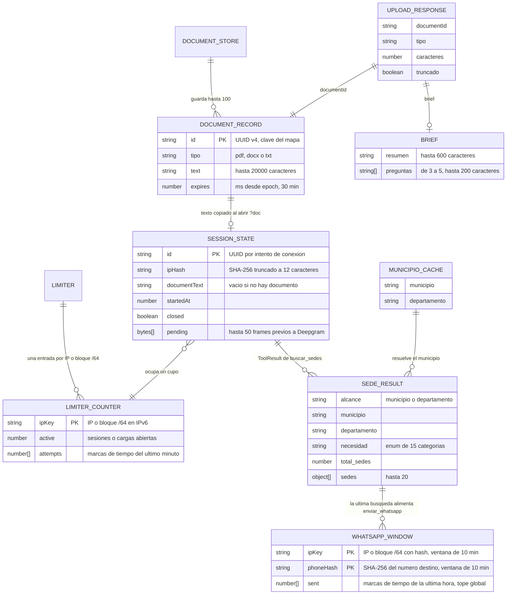

# Modelo de datos

El sistema no tiene base de datos (ADR 0002). Todo el estado vive en la memoria del proceso Node de cada instancia de Cloud Run y desaparece al reiniciarse. Este documento describe esas entidades en memoria, su retención y el tratamiento de datos sensibles. No hay migraciones, índices ni cifrado en reposo porque no hay nada en reposo.

## 1. Diagrama entidad-relación

Las relaciones son lógicas (cómo se pasan los datos entre funciones), no claves foráneas. Los módulos no comparten estructuras: `server.mjs` solo usa las funciones exportadas de cada uno.

## 2. Diccionario de datos

### 2.1 Registro del almacén de documentos (`web/server/documents.mjs`, `createDocumentStore`)

Un `Map` de UUID a `{ record, expires }`. Fuera de este módulo solo se obtiene `record` con `get(id)`.

| Campo | Tipo | Regla |
|---|---|---|
| `id` (clave) | UUID v4 | Generado con `randomUUID()`; `get` rechaza cualquier cadena que no tenga forma de UUID |
| `record.tipo` | `pdf`, `docx` o `txt` | Decidido por la firma del contenido, nunca por la extensión ni el `Content-Type` |
| `record.text` | cadena | Texto normalizado, máximo 20 000 caracteres (`MAX_CHARS`); lo que excede se descarta y se informa `truncado` |
| `expires` | número | Instante de vencimiento: ahora más 30 minutos (`ttlMs`) |

Integridad: máximo 100 entradas (`max`); al insertar se borran primero las vencidas y luego las más antiguas. No se guarda el nombre del archivo, el archivo original ni el brief.

### 2.2 Contadores del limitador (`web/server/limits.mjs`, `createLimiter`)

Hay dos limitadores independientes: uno para sesiones de voz (`perIp` 2, `global` 8, `ratePerMin` 10) y otro para cargas de documento (`perIp` 1, `global` 4, `ratePerMin` 5), definido en `server.mjs`.

| Estructura | Contenido | Regla |
|---|---|---|
| `active` | Mapa clave de IP a número de sesiones o cargas abiertas | Se incrementa al admitir y se decrementa en `release()` (idempotente); la entrada se borra al llegar a 0 |
| `attempts` | Mapa clave de IP a marcas de tiempo del último minuto | Se poda cada minuto: se olvidan las IP sin actividad reciente |
| `total` | Entero | Cuenta global de sesiones o cargas abiertas |
| Clave de IP (`ipKey`) | IP v4 tal cual; IPv6 reducida a su bloque /64 | Evita eludir el límite rotando direcciones dentro de un /64 |

### 2.3 Estado de sesión (`runSession` en `web/server.mjs`)

Vive en el cierre de la función de cada sesión de voz; no existe un objeto compartido entre sesiones.

| Elemento | Descripción |
|---|---|
| `id` | UUID generado en el upgrade; identificador de correlación en los logs |
| `ip` | Hash de la IP (SHA-256 hexadecimal truncado a 12 caracteres) |
| `documentText` | Texto del documento copiado del almacén al abrir la sesión con `?doc=<id>`; cadena vacía si no hay documento |
| `upstream` | Conexión WebSocket a Deepgram, una por sesión |
| `pending` | Hasta 50 frames de audio recibidos antes de que abra Deepgram |
| `maxTimer` | Temporizador de 10 minutos que cierra la sesión con 4000 |
| `closed` | Evita cerrar dos veces y liberar dos veces el cupo |

La transcripción y los resultados de la herramienta no se acumulan en el servidor: pasan de Deepgram al navegador y quedan solo en la pantalla de la persona. La diarización y el sentimiento (RF-007, RF-008) siguen la misma regla: el servidor arma las intervenciones en memoria mientras dura la sesión y las envía al navegador sin guardarlas ni registrarlas en logs (solo se registra la cantidad de intervenciones).

| Mensaje | Campo | Tipo | Descripción |
|---|---|---|---|
| `Transcript` | `id` | string | Identificador de la intervención dentro de la sesión (`t1`, `t2`...) |
| `Transcript` | `speaker` | entero | Índice de hablante de Deepgram, desde 0; la interfaz lo muestra como Hablante 1, 2... |
| `Transcript` | `text` | string | Texto final de la intervención |
| `Transcript` | `start`, `end` | número | Segundos desde el inicio de la sesión, un decimal |
| `Sentiment` | `id` | string | El `id` de la intervención que califica |
| `Sentiment` | `sentimiento` | enum | `positivo`, `neutral` o `negativo` |
| `Sentiment` | `emocion` | enum | `calma`, `alegria`, `preocupacion`, `miedo`, `enojo`, `tristeza`, `frustracion`, `urgencia` o `confusion` |
| `Sentiment` | `intensidad` | número | De 0 a 1, dos decimales |

### 2.4 Resultado de `buscar_sedes` (`web/server/ips.mjs`, contrato en `docs/api/websocket-protocol.md` sección 4.1)

| Campo | Tipo | Notas |
|---|---|---|
| `alcance` | `municipio` o `departamento` | `departamento` cuando el municipio no tiene sedes del tipo pedido |
| `municipio`, `departamento` | texto | Nombres oficiales resueltos, no lo dicho por la persona |
| `necesidad` | enum de 15 valores | `consulta_general`, `urgencias`, `partos`, `neonatal`, `pediatria`, `uci_adultos`, `hospitalizacion`, `cirugia`, `dialisis`, `cancer`, `quemados`, `salud_mental`, `adicciones`, `ambulancia`, `unidad_movil` |
| `total_sedes` | entero | Total encontrado antes del tope de 20 |
| `sedes[]` | hasta 20, ordenadas por capacidad total descendente | Cada una: `sede`, `prestador`, `direccion`, `telefono`, `naturaleza`, `nivel` (número o `null`) y `capacidades[]` con `tipo` y `cantidad`. Cualquier campo puede ser `null` |
| Errores | `{error}` | `parametros_invalidos`, `municipio_no_encontrado` (con `sugerencias` de hasta 3), `servicio_no_disponible`, `funcion_desconocida` |

El agregado interno `total` por sede se elimina antes de responder. La caché de municipios (`municipiosPromise`) guarda solo pares `{ municipio, departamento }` del registro y se llena una vez por proceso.

### 2.5 Ventanas de envío por WhatsApp (`web/server/whatsapp.mjs`, `createWhatsApp`, RF-024)

Estado en memoria de la instancia, creado solo si `WHATSAPP_ACCESS_TOKEN` y `WHATSAPP_PHONE_NUMBER_ID` están definidos.

| Elemento | Descripción |
|---|---|
| Ventana por IP | Mapa clave de cliente (IPv6 por bloque /64, con hash) a marca de tiempo del último intento; vence a los 10 minutos |
| Ventana por número | Mapa SHA-256 del teléfono destino (12 caracteres hexadecimales) a marca de tiempo; vence a los 10 minutos. El número en claro no se guarda |
| Envíos de la última hora | Lista de marcas de tiempo; con `WHATSAPP_MAX_PER_HOUR` (3 por defecto) como tope global |
| Última búsqueda (`lastSedes`) | Copia, en el cierre de `runSession`, del último resultado exitoso de `buscar_sedes`; es la única fuente del mensaje y se descarta al cerrar la sesión |

Todo se cuenta al intentar, no al lograr. Los contadores son por instancia.

### 2.6 DTOs de la carga de documento (`POST /api/document`, `docs/api/openapi.yaml`)

| DTO | Campos |
|---|---|
| Entrada | Cuerpo binario en bruto, máximo 20 MB; no se usa nombre ni `Content-Type` del cliente |
| Respuesta 201 | `documentId` (UUID v4), `tipo`, `caracteres` (1 a 20 000), `truncado`, `brief` (objeto o `null`) |
| `brief` | `resumen` (1 a 600 caracteres) y `preguntas` (3 a 5, cada una de 1 a 200 caracteres) |
| Error | `{ "error": "<código>", "mensaje": "<texto en español>" }` con códigos `origen_no_permitido`, `vacio`, `demasiado_grande`, `tipo_no_soportado`, `sin_texto`, `demasiadas_cargas`, `error_interno` |

## 3. Retención

| Dato | Dónde | Cuánto vive | Cómo se borra |
|---|---|---|---|
| Texto del documento | Memoria de la instancia | 30 minutos desde la carga | Vencimiento, desalojo al llegar a 100 entradas o reinicio de la instancia |
| Archivo original subido | Solo en memoria durante la petición | Lo que dure el procesamiento | Se descarta al terminar; nunca se escribe en disco |
| Audio de la conversación | Tránsito entre navegador, servidor y Deepgram | Sin retención en nuestro servidor | No se guarda; la política de retención de Deepgram es del proveedor |
| Transcripción y tarjetas de sedes | Pantalla del navegador | La vida de la pestaña | No se registran en el servidor |
| Contadores del limitador | Memoria | Un minuto de intentos; los cupos hasta liberarse | Poda periódica y `release()` |
| Caché de municipios | Memoria | La vida del proceso | Reinicio |
| Ventanas de envío por WhatsApp | Memoria | 10 minutos por IP y por número (solo hash); 1 hora para el tope global | Poda en cada intento y reinicio de la instancia |
| Logs | Cloud Logging (stdout JSON) | Retención por defecto del proyecto GCP | Borrado del proyecto al terminar el evento |

No persiste nada entre reinicios, y nada se comparte entre instancias: con `max-instances` 2 y afinidad de sesión de mejor esfuerzo, un documento puede no encontrarse si la voz llega a otra instancia; la persona debe volver a subirlo (`docs/ARCHITECTURE.md` sección 13).

## 4. Datos sensibles

- Registro de IPS: la herramienta selecciona una lista blanca de 12 columnas (`COLUMNS` en `web/server/ips.mjs`) que excluye `gerente` y `email`. El agente tampoco los pronuncia (regla del prompt y RF-013).
- Texto del documento: puede contener datos personales de quien lo sube. Se trata como dato no confiable (cercado y con `fenceSafe`), vive 30 minutos en memoria y no se escribe en logs: `document_uploaded` registra solo tipo, número de caracteres, `truncado`, si hubo brief y duración.
- Transcripciones y audio: no se registran. Los logs de herramienta guardan el nombre, el código de error y el total de sedes, no los argumentos (municipio, necesidad).
- IP del cliente: se registra solo como SHA-256 truncado a 12 caracteres. La IP completa se usa en memoria para los contadores y no se escribe.
- Teléfono para WhatsApp (RF-024): se dicta por voz, así que pasa por Deepgram y DeepSeek (argumento de la herramienta) y llega a Meta como destino del mensaje. En el servidor no se guarda ni se registra: solo vive su SHA-256 truncado en la ventana de 10 minutos. El consentimiento es el sí explícito hablado tras la repetición en grupos 3-3-4.
- Claves: solo en variables de entorno del proceso; nunca en el navegador, la imagen ni los logs.
- Excepción conocida: el `documentId` va en la URL de `/ws/agent?doc=<id>` y por eso puede quedar en los registros de peticiones de Cloud Run (`docs/SECURITY.md`, deuda de seguridad).
- Terceros: Deepgram recibe el audio y el texto del documento y de la conversación; DeepSeek recibe el texto de la conversación y del documento. datos.gov.co solo recibe nombres oficiales de municipio y departamento y el tipo de atención. Meta (WhatsApp) recibe el número de destino y la lista de sedes, solo si la persona lo pidió.
