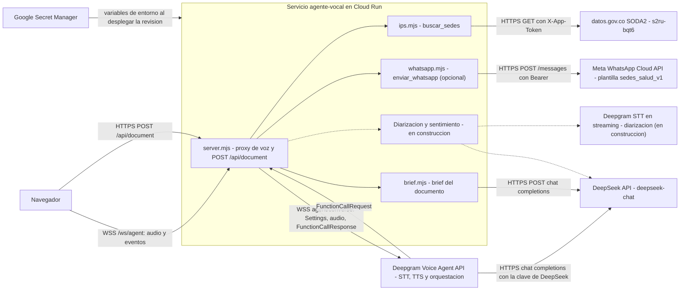

# Integraciones

Servicios externos del sistema, tal como están en el código (`web/server.mjs`, `web/server/*.mjs`, `infra/deploy.sh`). Para el flujo de un turno de voz ver `docs/ARCHITECTURE.md` sección 5; para el manejo de fallos por integración, la sección 10 del mismo documento. No hay integraciones entre módulos por red: los módulos se llaman por funciones dentro del mismo proceso.

Resumen:

| Integración | Dirección | Protocolo | Autenticación | Timeout | Reintentos |
|---|---|---|---|---|---|
| Deepgram Voice Agent | Servidor a Deepgram | WSS | `Authorization: Token <clave>` | Handshake 10 s; sesión máxima 10 min | Ninguno |
| Deepgram STT en streaming (diarización) | Servidor a Deepgram | WSS | `Authorization: Token <clave>` | Handshake 10 s; KeepAlive cada 5 s | Ninguno: si cae, solo se pierde el panel |
| DeepSeek vía Deepgram | Deepgram a DeepSeek | HTTPS | Clave de DeepSeek entregada en `Settings` | Lo impone Deepgram | Lo decide Deepgram |
| DeepSeek directo (brief) | Servidor a DeepSeek | HTTPS | `Authorization: Bearer <clave>` | 25 s | Ninguno |
| DeepSeek directo (sentimiento) | Servidor a DeepSeek | HTTPS | Igual que el brief | 4 s por intervención | Ninguno: la intervención queda sin etiqueta |
| datos.gov.co | Servidor a datos.gov.co | HTTPS | `X-App-Token` opcional | 8 s por petición, 12 s por llamada | Ninguno |
| WhatsApp Cloud API (opcional) | Servidor a Meta | HTTPS | `Authorization: Bearer <WHATSAPP_ACCESS_TOKEN>` | 8 s | Ninguno |
| Secret Manager | Cloud Run a Secret Manager | API de GCP, al desplegar | Identidad `agente-vocal-run` | No aplica | No aplica |
| Cloud Run | Plataforma | HTTPS y WSS | Acceso público (ADR 0004) | Petición 3600 s | No aplica |

## 1. Deepgram Voice Agent API

- Propósito: hace en una sola conexión el STT (`nova-3`, español, `keyterms` IPS, EPS y urgencias), la orquestación del LLM y el TTS (`aura-2-celeste-es`) de cada turno, y notifica las llamadas a funciones. Código: `web/server.mjs` (`runSession`) y `web/server/agent-settings.mjs` (`buildSettings`).
- Dirección: nuestro servidor abre la conexión de salida; Deepgram envía eventos y audio por la misma conexión.
- Protocolo: WebSocket seguro a `wss://agent.deepgram.com/v1/agent/converse`. Audio de entrada `linear16` a 16 kHz, de salida `linear16` a 24 kHz sin contenedor.
- Autenticación: cabecera `Authorization: Token <DEEPGRAM_API_KEY>`. La clave viene de Secret Manager como variable de entorno y no llega al navegador.
- Datos enviados: mensaje `Settings` (prompt con las reglas del ADR 0001, el texto del documento cercado entre `<documento>` y `</documento>` si existe, definición de `buscar_sedes`, modelos, saludo y la clave de DeepSeek), audio del usuario sin modificar, `KeepAlive` reescrito en forma canónica y `FunctionCallResponse`. Deepgram recibe la voz de la persona: es el proveedor de mayor sensibilidad.
- Timeouts: `handshakeTimeout` de 10 s. La sesión se cierra a los 10 min (`SESSION_MAX_MS`). Los frames del navegador que llegan antes de que abra la conexión se guardan hasta 50.
- Reintentos: ninguno. El servidor no reconecta con Deepgram; la sesión termina y la persona reconecta.
- Comportamiento ante fallo: error de socket o cierre inesperado cierran la sesión del navegador con 1011 (`upstream_error` o `upstream_closed`), registran el evento y liberan el cupo. Un mensaje `Error` de Deepgram con la sesión abierta se registra como `upstream_error` y al navegador solo llega el texto fijo "El servicio de voz tuvo un problema. Intenta de nuevo."
- Plan si cae: no hay alternativa de STT ni TTS, por decisión del ADR 0002. La interfaz informa el corte y ofrece volver a intentar. La carga de documento y su brief siguen funcionando porque no dependen de Deepgram.

## 2. Deepgram STT en streaming para diarización

- Propósito: una segunda conexión de reconocimiento de voz con separación de hablantes, para mostrar en la transcripción "Hablante 1", "Hablante 2" y "Gabriela" con marca de tiempo (RF-007). Código: `web/server/diarize.mjs` (`createDiarizer`, `groupWords`), conectado desde `runSession` en `web/server.mjs`.
- Dirección y protocolo: WebSocket saliente a `wss://api.deepgram.com/v1/listen` con `model=nova-3`, `language=es`, `diarize=true`, `punctuate`, `smart_format`, `encoding=linear16`, `sample_rate=16000`, `endpointing=300`, `utterance_end_ms=1000` e `interim_results=true` (Deepgram lo exige para `utterance_end_ms`; el código solo usa los resultados finales y el costo es por segundo de audio, no por resultado).
- Autenticación: `Authorization: Token <DEEPGRAM_API_KEY>`.
- Datos enviados: el mismo audio PCM del micrófono que va al agente, más `KeepAlive` cada 5 s y `CloseStream` al cerrar.
- Timeouts: handshake de 10 s. Si Deepgram queda más de 1 MB atrás, se descartan tramas; el audio anterior a que abra esta conexión no se transcribe.
- Reintentos: ninguno.
- Fallo: se registra `diarize_error` y se deja de reenviar audio a esta conexión; la sesión de voz sigue igual, solo sin `Transcript` (la interfaz usa entonces el texto de `ConversationText`). El texto de las intervenciones nunca se registra; `diarize_end` solo cuenta intervenciones.
- Costo: duplica los minutos de transcripción por sesión.
- Pendiente: con dos voces sintéticas cortas, Deepgram las asignó al mismo hablante; el criterio de 80 % de RF-007 se mide con voces reales.

## 3. DeepSeek

DeepSeek se usa por dos caminos distintos, con la misma clave (`DEEPSEEK_API_KEY`).

### 3.1 Vía Deepgram (conversación)

- Propósito: es el modelo `deepseek-chat` (`temperature` 0,2) que decide el contenido de cada turno y cuándo llamar a `buscar_sedes`.
- Dirección y protocolo: Deepgram llama a `https://api.deepseek.com/chat/completions` (compatible con OpenAI) usando el endpoint y la cabecera `authorization: Bearer <clave>` que nuestro servidor le entrega en `Settings`.
- Datos enviados: historial de la conversación, prompt, texto del documento y resultados de la herramienta. Los envía Deepgram, no nuestro servidor.
- Timeouts y reintentos: los define Deepgram; nuestro servidor no impone un tope propio al modelo (el límite es la sesión de 10 min). El LLM es el componente dominante de la latencia: de 0,8 a 1,05 s en el spike.
- Fallo: Deepgram emite `Error`, que sigue el caso de la sección 1. El navegador ve el estado "pensando" más largo o el mensaje genérico.
- Riesgo aceptado: la clave de DeepSeek viaja a Deepgram dentro de `Settings`. Mitigación: clave dedicada al evento, revocada al desmontar (`docs/SECURITY.md`).

### 3.2 Directo desde el servidor: brief del documento

- Propósito: tras cargar un documento, un resumen de hasta 2 oraciones y de 3 a 5 preguntas sugeridas (RF-003). Código: `web/server/brief.mjs` (`generateBrief`), invocado desde `handleUpload` en `web/server.mjs`.
- Dirección y protocolo: POST HTTPS a `https://api.deepseek.com/chat/completions`, `model` `deepseek-chat`, `temperature` 0,3, `max_tokens` 500, `response_format` `json_object`.
- Autenticación: `Authorization: Bearer <DEEPSEEK_API_KEY>`.
- Datos enviados: hasta 12 000 caracteres del texto del documento, entre `<documento>` y `</documento>` con `fenceSafe`, y el prompt de sistema que lo declara dato y no instrucción. El texto no se registra en logs.
- Timeout: 25 s (`AbortSignal.timeout`). Reintentos: ninguno.
- Fallo: cualquier error (red, timeout, HTTP distinto de 200, JSON o forma inválidos) se registra como `brief_failed` con un código (`timeout`, `network`, `http_<n>`, `invalid_json`, `invalid_shape`) y la función devuelve `null`. La carga igual responde 201 con `brief: null`; el documento queda disponible para la voz, pero no cumple RF-003 en esa carga.
- Plan si cae: la persona puede usar el documento por voz sin brief. No hay modelo alternativo.

### 3.3 Directo desde el servidor: sentimiento por intervención

- Propósito: clasificar cada intervención de una persona para el panel de sentimiento (RF-008), mensaje `Sentiment`. Código: `web/server/sentiment.mjs` (`classifySentiment`), invocado desde `web/server.mjs` cuando el diarizador cierra una intervención de 2 palabras o más.
- Dirección y protocolo: POST HTTPS a `https://api.deepseek.com/chat/completions`, `deepseek-chat`, `temperature` 0, `max_tokens` 60, `response_format` `json_object`.
- Autenticación: `Authorization: Bearer <DEEPSEEK_API_KEY>`.
- Datos enviados: el texto de la intervención entre `<intervencion>` y `</intervencion>`, declarado como dato y no instrucción.
- Timeout: 4 s. Reintentos: ninguno. Como máximo 2 llamadas en curso por sesión; las intervenciones que exceden ese tope se quedan sin sentimiento en lugar de encolarse, para acotar el costo.
- Fallo: cualquier error o una respuesta fuera de los enums se registra como `sentiment_failed` con un código corto y no se envía nada; la conversación no se afecta.
- Latencia medida: de 1,2 a 1,3 s desde que se emite la intervención hasta el `Sentiment` (umbral de RF-008: 2 s).

## 4. datos.gov.co, dataset de IPS (SODA2, `s2ru-bqt6`)

- Propósito: fuente de verdad de las sedes de salud para la herramienta `buscar_sedes` (RF-009). Código: `web/server/ips.mjs`.
- Dirección y protocolo: GET HTTPS a `https://www.datos.gov.co/resource/s2ru-bqt6.json` con parámetros SoQL (`$select`, `$where`, `$order`, `$limit`, `$offset`, `$group`), codificados con `encodeURIComponent`.
- Autenticación: cabecera `X-App-Token` con `DATOSGOV_APP_TOKEN` si está definido; sin token la API aplica límites más bajos.
- Datos enviados: solo valores de enums de la herramienta y nombres oficiales de municipio y departamento, con comillas escapadas (`soqlString`). Nunca texto libre del usuario o del modelo. Columnas pedidas: lista blanca fija sin `gerente` ni `email`.
- Volumen: páginas de 1000 filas, tope de 5000 filas, hasta 20 sedes por respuesta. La lista de municipios se descarga una vez por proceso y se guarda en memoria (caché solo de éxitos).
- Timeouts: 8 s por petición (`AbortSignal.timeout(8000)`) y plazo total de 12 s por llamada a la herramienta (`TOOL_DEADLINE_MS` en `server.mjs`).
- Reintentos: uno inmediato ante respuestas 5xx. Las consultas exitosas se guardan en memoria (hasta 500) porque el registro es una foto fija, y la lista de municipios se precarga al arrancar el servidor.
- Fallo: si la API falla se usa la copia local (siguiente punto). Solo si también falla la copia, la herramienta devuelve `{"error":"servicio_no_disponible"}` y el prompt obliga al agente a decir que no pudo consultar, sin inventar sedes; se registra `buscar_sedes_failed` en JSON.
- Plan si cae: copia local de respaldo. `web/server/data/ips-snapshot.json.gz` (41 427 filas, unos 0,8 MB, solo las columnas de la lista blanca) se genera con `node --env-file-if-exists=../.env scripts/snapshot-ips.mjs` desde `web/`. La API sigue siendo la fuente principal: cada búsqueda tiene un presupuesto de 6,5 s para la API (reintento de 5xx incluido); si falla (5xx, vencimiento o red), `ips.mjs` aplica los mismos filtros sobre la copia en memoria (cargada una vez) y devuelve la misma estructura, con el mismo respaldo municipio y luego departamento. `loadMunicipios` cae también a la lista de la copia. Cada respaldo deja una línea JSON `{"severity":"WARNING","event":"ips_fallback","reason":...}` sin texto del usuario. Los resultados del respaldo no entran en la caché de consultas, así que la siguiente búsqueda vuelve a intentar la API.

## 5. WhatsApp Cloud API de Meta (opcional, RF-024)

- Propósito: enviar a la persona, a su celular y solo si lo acepta, las sedes de la última búsqueda. Código: `web/server/whatsapp.mjs` (`validateArgs`, `buildParams`, `createWhatsApp`), invocado desde `handleFunctions` en `web/server.mjs` cuando el modelo llama a la herramienta `enviar_whatsapp {telefono, sedes:[int]}`. La definición de la herramienta y la sección `WHATSAPP_PROMPT` solo existen si `WHATSAPP_ACCESS_TOKEN` y `WHATSAPP_PHONE_NUMBER_ID` están definidos.
- Dirección y protocolo: POST HTTPS a `https://graph.facebook.com/{WHATSAPP_API_VERSION}/{WHATSAPP_PHONE_NUMBER_ID}/messages` (versión `v25.0` por defecto).
- Autenticación: `Authorization: Bearer <WHATSAPP_ACCESS_TOKEN>`, token de usuario del sistema de larga duración guardado en Secret Manager (`whatsapp-access-token`). `WHATSAPP_BUSINESS_ACCOUNT_ID` solo sirve para administrar plantillas; el servidor no lo usa.
- Plantilla: `sedes_salud_v1`, categoría UTILITY, idioma `es`, enviada a Meta el 2026-10-09 y pendiente de aprobación al escribir esto. Cuerpo: "Hola. Estas son las sedes de salud que pediste en {{1}}: {{2}} Datos del Registro Especial de Prestadores de Salud (datos.gov.co). Confirma horarios por teléfono antes de ir. Si es una emergencia, llama al 123." Pie: "Gabriela - ¿Dónde me atienden?". Remitente: el número de Solutions Tech Web en la Cloud API, con nivel de mensajería de 250 destinatarios por día.
- Datos enviados: `{{1}}` es el lugar (municipio y departamento; solo departamento si la búsqueda tuvo alcance de departamento) y `{{2}}` la lista "1) nombre, dirección, tel X." con espacios colapsados y máximo 700 caracteres. El servidor la arma con su copia de la última búsqueda exitosa de `buscar_sedes`; el modelo solo aporta el teléfono y las posiciones (máximo 3), nunca el texto. El número viaja a Meta en el campo `to`.
- Privacidad: el número se dicta por voz, así que pasa por Deepgram (STT) y por DeepSeek (como argumento de la herramienta); el producto lo aceptó y el consentimiento es el sí explícito hablado tras la repetición en grupos 3-3-4. El número no se guarda; en el servidor solo vive su hash SHA-256 en la ventana de 10 minutos. No se reenvía nada al navegador por esta herramienta (sin mensaje nuevo en el WebSocket): Gabriela confirma por voz y la transcripción lo muestra.
- Límites (se cuentan al intentar, no al lograr): 1 mensaje por IP de cliente (IPv6 por bloque /64, con hash) cada 10 minutos, 1 por número destino (hash SHA-256) cada 10 minutos y 3 por hora en total (`WHATSAPP_MAX_PER_HOUR`). Están en memoria por instancia: con `max-instances` 2 el tope global real puede ser el doble (comentario `ponytail:` en el código); si debe ser exacto, usar un almacén compartido.
- Timeout: 8 s. Reintentos: ninguno.
- Errores devueltos al modelo: `parametros_invalidos`, `telefono_invalido`, `sin_busqueda`, `sedes_invalidas`, `limite_alcanzado`, `limite_global` y `no_disponible` (cualquier fallo de Meta o de red). Gabriela lo explica en una frase y no reintenta.
- Registros: `tool_call`, `whatsapp_sent {phone: hash}` y `whatsapp_failed {phone: hash, status, code | reason}`. Nunca el número ni el token.
- Plan si cae o se rechaza: la conversación de voz sigue igual; solo falla el envío con `no_disponible`. Si Meta rechaza la plantilla o la recategoriza a MARKETING, todos los envíos fallan hasta aprobar otra. Sin las variables, la función queda desactivada.
- Riesgos conocidos: dígitos dictados mal reconocidos (mitigado con la repetición 3-3-4 y la confirmación); plantilla aún pendiente; el token del usuario del sistema es de larga duración y debe rotarse al terminar el evento; el nombre visible del número aún no está aprobado, por lo que el destinatario puede ver solo el número.

## 6. Google Secret Manager

- Propósito: guardar `deepseek-api-key`, `deepgram-api-key` y `datosgov-app-token`, replicados en `us-east1`, y `whatsapp-access-token` si se activa RF-024 (variable `WHATSAPP_ACCESS_TOKEN`).
- Dirección y protocolo: no hay llamadas en tiempo de ejecución. Al desplegar, Cloud Run resuelve cada secreto y lo inyecta como variable de entorno (`DEEPSEEK_API_KEY`, `DEEPGRAM_API_KEY`, `DATOSGOV_APP_TOKEN`). `infra/deploy.sh` fija la versión habilitada más reciente de cada secreto (`--set-secrets=NOMBRE=secreto:version`) para que una revisión sea reproducible.
- Autenticación: la cuenta de servicio `agente-vocal-run` tiene solo `roles/secretmanager.secretAccessor` sobre esos tres secretos.
- Fallo y plan: si un secreto no existe o no es accesible, el despliegue de la revisión falla y la revisión anterior sigue sirviendo. Rotar una clave exige crear una versión nueva y volver a ejecutar `bash infra/deploy.sh`; el proceso no relee secretos en caliente. Si faltan `DEEPGRAM_API_KEY` o `DEEPSEEK_API_KEY` el proceso termina con código 1.

## 7. Cloud Run

- Propósito: plataforma de ejecución del contenedor único (ADR 0003). Servicio `agente-vocal` en el proyecto `agente-vocal-hackaton`, región `us-east1`.
- Protocolo: HTTPS y WSS terminados en el front end de Google; el servidor recibe HTTP en el puerto 8080 y toma la IP real de la última entrada de `X-Forwarded-For`.
- Autenticación: `allow-unauthenticated`; el control de abuso es de la aplicación (ADR 0004).
- Parámetros (de `infra/deploy.sh`): afinidad de sesión, `timeout` 3600 s, `min-instances` 0 (variable `MIN_INSTANCES`, 1 durante la evaluación), `max-instances` 2, 1 vCPU, 1 GiB, `concurrency` 40, sondas de arranque y de vida sobre `/api/health`.
- Límites relevantes: cuando se supera la capacidad (unas 770 peticiones por segundo servidas con 2 instancias), Cloud Run responde 429 y no 5xx (R-017, `docs/CAPACITY.md`).
- Fallo y plan: una instancia que se recicla pierde sus sesiones y documentos en memoria; el usuario reconecta y vuelve a subir el documento. Una caída de `us-east1` deja el servicio caído (aceptado, un solo evento). Despliegue de respaldo: volver a ejecutar `infra/deploy.sh` desde cualquier equipo con acceso al proyecto.
