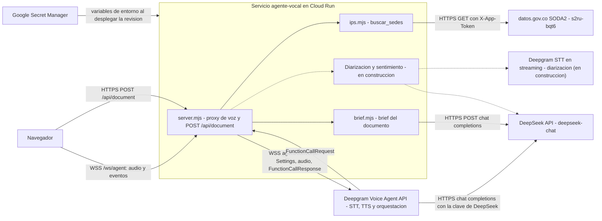

# Integraciones

Servicios externos del sistema, tal como están en el código (`web/server.mjs`, `web/server/*.mjs`, `infra/deploy.sh`). Para el flujo de un turno de voz ver `docs/ARCHITECTURE.md` sección 5; para el manejo de fallos por integración, la sección 10 del mismo documento. No hay integraciones entre módulos por red: los módulos se llaman por funciones dentro del mismo proceso.

Resumen:

| Integración | Dirección | Protocolo | Autenticación | Timeout | Reintentos |
|---|---|---|---|---|---|
| Deepgram Voice Agent | Servidor a Deepgram | WSS | `Authorization: Token <clave>` | Handshake 10 s; sesión máxima 10 min | Ninguno |
| Deepgram STT en streaming (diarización) | Servidor a Deepgram | WSS | Por definir | Por definir | En construcción |
| DeepSeek vía Deepgram | Deepgram a DeepSeek | HTTPS | Clave de DeepSeek entregada en `Settings` | Lo impone Deepgram | Lo decide Deepgram |
| DeepSeek directo (brief) | Servidor a DeepSeek | HTTPS | `Authorization: Bearer <clave>` | 25 s | Ninguno |
| DeepSeek directo (sentimiento) | Servidor a DeepSeek | HTTPS | Igual que el brief | Por definir | En construcción |
| datos.gov.co | Servidor a datos.gov.co | HTTPS | `X-App-Token` opcional | 8 s por petición, 12 s por llamada | Ninguno |
| Secret Manager | Cloud Run a Secret Manager | API de GCP, al desplegar | Identidad `agente-vocal-run` | No aplica | No aplica |
| Cloud Run | Plataforma | HTTPS y WSS | Acceso público (ADR 0004) | Petición 3600 s | No aplica |

## 1. Deepgram Voice Agent API

- Propósito: hace en una sola conexión el STT (`nova-3`, español, `keyterms` IPS, EPS y urgencias), la orquestación del LLM y el TTS (`aura-2-celeste-es`) de cada turno, y notifica las llamadas a funciones. Código: `web/server.mjs` (`runSession`) y `web/server/agent-settings.mjs` (`buildSettings`).
- Dirección: nuestro servidor abre la conexión de salida; Deepgram envía eventos y audio por la misma conexión.
- Protocolo: WebSocket seguro a `wss://agent.deepgram.com/v1/agent/converse`. Audio de entrada `linear16` a 16 kHz, de salida `linear16` a 24 kHz sin contenedor.
- Autenticación: cabecera `Authorization: Token <DEEPGRAM_API_KEY>`. La clave viene de Secret Manager como variable de entorno y no llega al navegador.
- Datos enviados: mensaje `Settings` (prompt con las reglas del ADR 0001, el texto del documento cercado entre `<documento>` y `</documento>` si existe, definición de `buscar_sedes`, modelos, saludo y la clave de DeepSeek), audio del usuario sin modificar, `KeepAlive` reescrito en forma canónica y `FunctionCallResponse`. Deepgram recibe la voz de la persona: es el proveedor de mayor sensibilidad.
- Timeouts: `handshakeTimeout` de 10 s. La sesión se cierra a los 10 min (`SESSION_MAX_MS`). Los frames del navegador que llegan antes de que abra la conexión se guardan hasta 50.
- Reintentos: ninguno. El servidor no reconecta con Deepgram; la sesión termina y la persona reconecta.
- Comportamiento ante fallo: error de socket o cierre inesperado cierran la sesión del navegador con 1011 (`upstream_error` o `upstream_closed`), registran el evento y liberan el cupo. Un mensaje `Error` de Deepgram con la sesión abierta se registra como `upstream_error` y al navegador solo llega el texto fijo "El servicio de voz tuvo un problema. Intenta de nuevo."
- Plan si cae: no hay alternativa de STT ni TTS, por decisión del ADR 0002. La interfaz informa el corte y ofrece volver a intentar. La carga de documento y su brief siguen funcionando porque no dependen de Deepgram.

## 2. Deepgram STT en streaming para diarización (en construcción)

- Propósito: una segunda conexión de reconocimiento de voz con separación de hablantes, para mostrar en la transcripción "Hablante 1", "Hablante 2" y "Agente" con marca de tiempo (RF-007). Hoy la transcripción distingue solo "Tú" y "Agente" a partir de `ConversationText`.
- Estado: en construcción en el paso 5. Se añaden los mensajes `Transcript` (y `Sentiment`, ver sección 3) al protocolo del WebSocket. Autenticación, timeouts, reintentos y manejo de caídas se documentan aquí cuando la implementación termine; no se describen todavía para no afirmar algo que el código no hace.
- Restricción de diseño ya fijada: la sesión de voz no puede depender de este módulo; si falla, la conversación continúa sin diarización.

## 3. DeepSeek

DeepSeek se usa por dos caminos distintos, con la misma clave (`DEEPSEEK_API_KEY`).

### 3.1 Vía Deepgram (conversación)

- Propósito: es el modelo `deepseek-chat` (`temperature` 0,2) que decide el contenido de cada turno y cuándo llamar a `buscar_sedes`.
- Dirección y protocolo: Deepgram llama a `https://api.deepseek.com/chat/completions` (compatible con OpenAI) usando el endpoint y la cabecera `authorization: Bearer <clave>` que nuestro servidor le entrega en `Settings`.
- Datos enviados: historial de la conversación, prompt, texto del documento y resultados de la herramienta. Los envía Deepgram, no nuestro servidor.
- Timeouts y reintentos: los define Deepgram; nuestro servidor no impone un tope propio al modelo (el límite es la sesión de 10 min). El LLM es el componente dominante de la latencia: de 0,8 a 1,05 s en el spike.
- Fallo: Deepgram emite `Error`, que sigue el caso de la sección 1. El navegador ve el estado "pensando" más largo o el mensaje genérico.
- Riesgo aceptado: la clave de DeepSeek viaja a Deepgram dentro de `Settings`. Mitigación: clave dedicada al evento, revocada al desmontar (`docs/SECURITY.md`).

### 3.2 Directo desde el servidor: brief del documento

- Propósito: tras cargar un documento, un resumen de hasta 2 oraciones y de 3 a 5 preguntas sugeridas (RF-003). Código: `web/server/brief.mjs` (`generateBrief`), invocado desde `handleUpload` en `web/server.mjs`.
- Dirección y protocolo: POST HTTPS a `https://api.deepseek.com/chat/completions`, `model` `deepseek-chat`, `temperature` 0,3, `max_tokens` 500, `response_format` `json_object`.
- Autenticación: `Authorization: Bearer <DEEPSEEK_API_KEY>`.
- Datos enviados: hasta 12 000 caracteres del texto del documento, entre `<documento>` y `</documento>` con `fenceSafe`, y el prompt de sistema que lo declara dato y no instrucción. El texto no se registra en logs.
- Timeout: 25 s (`AbortSignal.timeout`). Reintentos: ninguno.
- Fallo: cualquier error (red, timeout, HTTP distinto de 200, JSON o forma inválidos) se registra como `brief_failed` con un código (`timeout`, `network`, `http_<n>`, `invalid_json`, `invalid_shape`) y la función devuelve `null`. La carga igual responde 201 con `brief: null`; el documento queda disponible para la voz, pero no cumple RF-003 en esa carga.
- Plan si cae: la persona puede usar el documento por voz sin brief. No hay modelo alternativo.

### 3.3 Directo desde el servidor: sentimiento por intervención (en construcción)

- Propósito: clasificar el sentimiento de cada intervención para el panel (RF-008), mensaje `Sentiment`.
- Estado: en construcción en el paso 5. Los detalles de timeout, reintentos y manejo de errores se completan al cerrar el paso; la regla de diseño es que su falla nunca afecta la sesión de voz.

## 4. datos.gov.co, dataset de IPS (SODA2, `s2ru-bqt6`)

- Propósito: fuente de verdad de las sedes de salud para la herramienta `buscar_sedes` (RF-009). Código: `web/server/ips.mjs`.
- Dirección y protocolo: GET HTTPS a `https://www.datos.gov.co/resource/s2ru-bqt6.json` con parámetros SoQL (`$select`, `$where`, `$order`, `$limit`, `$offset`, `$group`), codificados con `encodeURIComponent`.
- Autenticación: cabecera `X-App-Token` con `DATOSGOV_APP_TOKEN` si está definido; sin token la API aplica límites más bajos.
- Datos enviados: solo valores de enums de la herramienta y nombres oficiales de municipio y departamento, con comillas escapadas (`soqlString`). Nunca texto libre del usuario o del modelo. Columnas pedidas: lista blanca fija sin `gerente` ni `email`.
- Volumen: páginas de 1000 filas, tope de 5000 filas, hasta 20 sedes por respuesta. La lista de municipios se descarga una vez por proceso y se guarda en memoria (caché solo de éxitos).
- Timeouts: 8 s por petición (`AbortSignal.timeout(8000)`) y plazo total de 12 s por llamada a la herramienta (`TOOL_DEADLINE_MS` en `server.mjs`).
- Reintentos: ninguno. Si la descarga de municipios falla, la caché se descarta y la siguiente llamada vuelve a intentar.
- Fallo: cualquier error, HTTP distinto de 2xx o vencimiento devuelve `{"error":"servicio_no_disponible"}` al modelo y al navegador, y el prompt obliga al agente a decir que no pudo consultar, sin inventar sedes. `ips.mjs` escribe un `console.error` en texto plano (no JSON) con el mensaje.
- Plan si cae: sin alternativa en línea. Los datos tienen corte de noviembre de 2022 y cambian poco (ADR 0001), así que una copia local del dataset sería el siguiente paso si el servicio fuera inestable; no está implementada.

## 5. Google Secret Manager

- Propósito: guardar `deepseek-api-key`, `deepgram-api-key` y `datosgov-app-token`, replicados en `us-east1`.
- Dirección y protocolo: no hay llamadas en tiempo de ejecución. Al desplegar, Cloud Run resuelve cada secreto y lo inyecta como variable de entorno (`DEEPSEEK_API_KEY`, `DEEPGRAM_API_KEY`, `DATOSGOV_APP_TOKEN`). `infra/deploy.sh` fija la versión habilitada más reciente de cada secreto (`--set-secrets=NOMBRE=secreto:version`) para que una revisión sea reproducible.
- Autenticación: la cuenta de servicio `agente-vocal-run` tiene solo `roles/secretmanager.secretAccessor` sobre esos tres secretos.
- Fallo y plan: si un secreto no existe o no es accesible, el despliegue de la revisión falla y la revisión anterior sigue sirviendo. Rotar una clave exige crear una versión nueva y volver a ejecutar `bash infra/deploy.sh`; el proceso no relee secretos en caliente. Si faltan `DEEPGRAM_API_KEY` o `DEEPSEEK_API_KEY` el proceso termina con código 1.

## 6. Cloud Run

- Propósito: plataforma de ejecución del contenedor único (ADR 0003). Servicio `agente-vocal` en el proyecto `agente-vocal-hackaton`, región `us-east1`.
- Protocolo: HTTPS y WSS terminados en el front end de Google; el servidor recibe HTTP en el puerto 8080 y toma la IP real de la última entrada de `X-Forwarded-For`.
- Autenticación: `allow-unauthenticated`; el control de abuso es de la aplicación (ADR 0004).
- Parámetros (de `infra/deploy.sh`): afinidad de sesión, `timeout` 3600 s, `min-instances` 0 (variable `MIN_INSTANCES`, 1 durante la evaluación), `max-instances` 2, 1 vCPU, 1 GiB, `concurrency` 40, sondas de arranque y de vida sobre `/api/health`.
- Límites relevantes: cuando se supera la capacidad (unas 770 peticiones por segundo servidas con 2 instancias), Cloud Run responde 429 y no 5xx (R-017, `docs/CAPACITY.md`).
- Fallo y plan: una instancia que se recicla pierde sus sesiones y documentos en memoria; el usuario reconecta y vuelve a subir el documento. Una caída de `us-east1` deja el servicio caído (aceptado, un solo evento). Despliegue de respaldo: volver a ejecutar `infra/deploy.sh` desde cualquier equipo con acceso al proyecto.
